# Darts-Hub 2.0 – User guide

Install online: The [online installer](docs/ONLINE_INSTALLER.md) detects your system and asks for GUI, TUI or headless mode and login autostart.

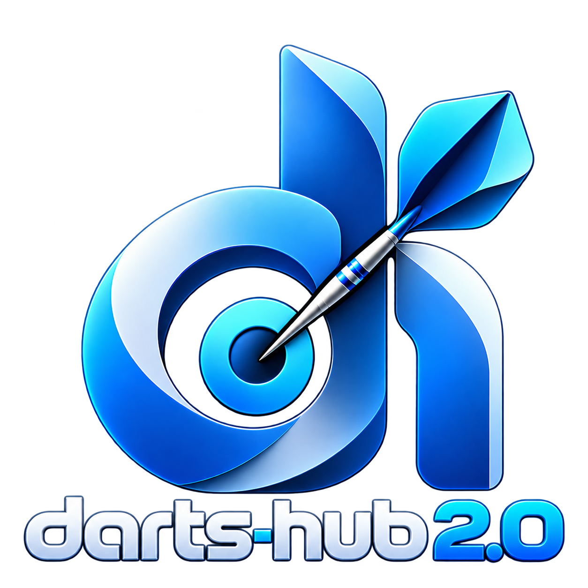

[Deutsch](README.md) · **English**

Darts-Hub connects your Autodarts board to voice announcements, WLED lighting and PixelIt displays. Choose the extensions you want to use. WLED and PixelIt also work with the Caller switched off.

## Browser control

While GUI or headless is running, open `http://HOST-IP:8079` on your local network.  [Web interface guide](docs/WEB_INTERFACE.md#english).

## Quick start

1. Download the package for your operating system and extract it completely.
2. Start **DartsHub**.
3. Sign in under **Autodarts** and enter your board ID.
4. Set up the extensions you want and save their settings.
5. Start a game in Autodarts. The dashboard and console show what is happening.

The screenshots show the actual interface with **example data**. Addresses, statuses and `DEMO-CODE` are for illustration only; use your own details. Some settings may require scrolling, depending on your window size.

## 1. Download and start

Choose **Windows**, **Linux** or **macOS** and the correct architecture: **x64** for most Intel/AMD computers, **ARM64** for ARM devices such as Apple Silicon Macs. Use a stable release for everyday play. Beta releases include newer features but may still have bugs.

| Operating system | Start |
| --- | --- |
| Windows | Double-click `DartsHub.exe` |
| Linux | Run `./DartsHub` in the extracted folder |
| macOS | Open `DartsHub.app` |

You do not need to start an additional API or other DartsHub programs. Release packages do not require a separate .NET installation. Controllers and displays must be reachable from your computer. Signing in and downloading soundpacks require internet access.

## 2. The interface

The left menu opens the dashboard, Autodarts, extensions, console, settings and support. Collapse it using the menu button; its icons remain clickable. Hover over an icon or setting to read its explanation.

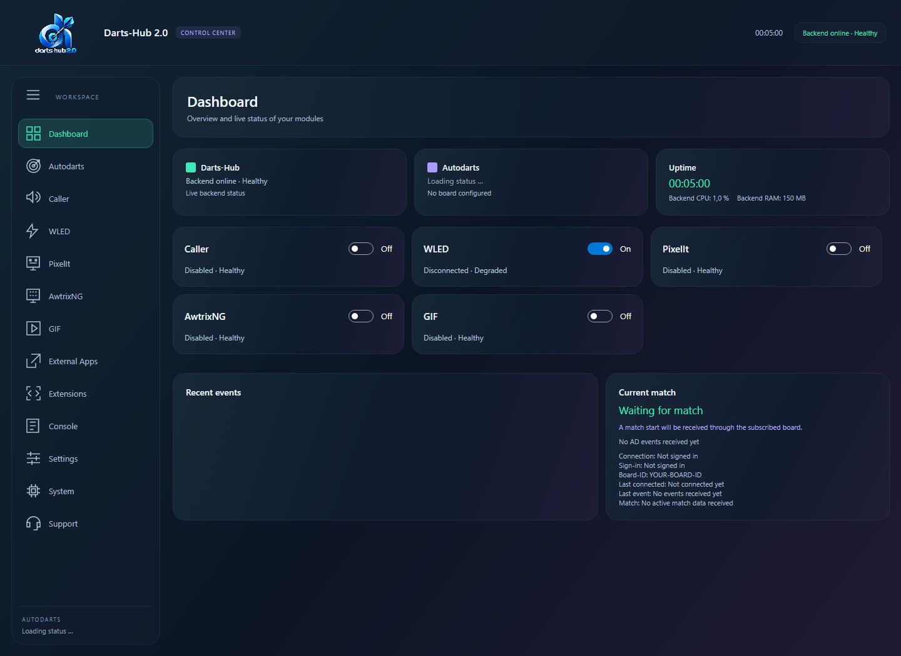

Use the switches on the extension cards to turn Caller, WLED, PixelIt, AwtrixNG and GIF on or off immediately. The state is saved; devices and event rules are preserved. An animation indicates that the change is being applied.

The **dashboard** shows connections, the game and extension statuses. “Disconnected” or “Disabled” is expected for extensions you do not use. Immediately after startup, some statuses may still be waiting for their first update.

Switch between English and German under **Settings → General**.

## 3. Sign in to Autodarts

1. Open **Autodarts** and its sign-in dialog.
2. Enter your **board ID**, found in your Autodarts board details or board link.
3. Start signing in. The application handles the technical sign-in details automatically.

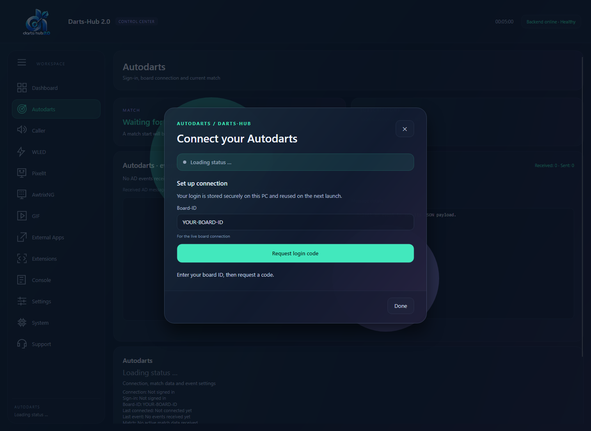

4. Darts-Hub displays a **sign-in code** and a verification page. Open that page, sign in to Autodarts and confirm the displayed code.
5. Wait for Darts-Hub to detect approval and show the connection. Save changed Autodarts settings using the provided button.

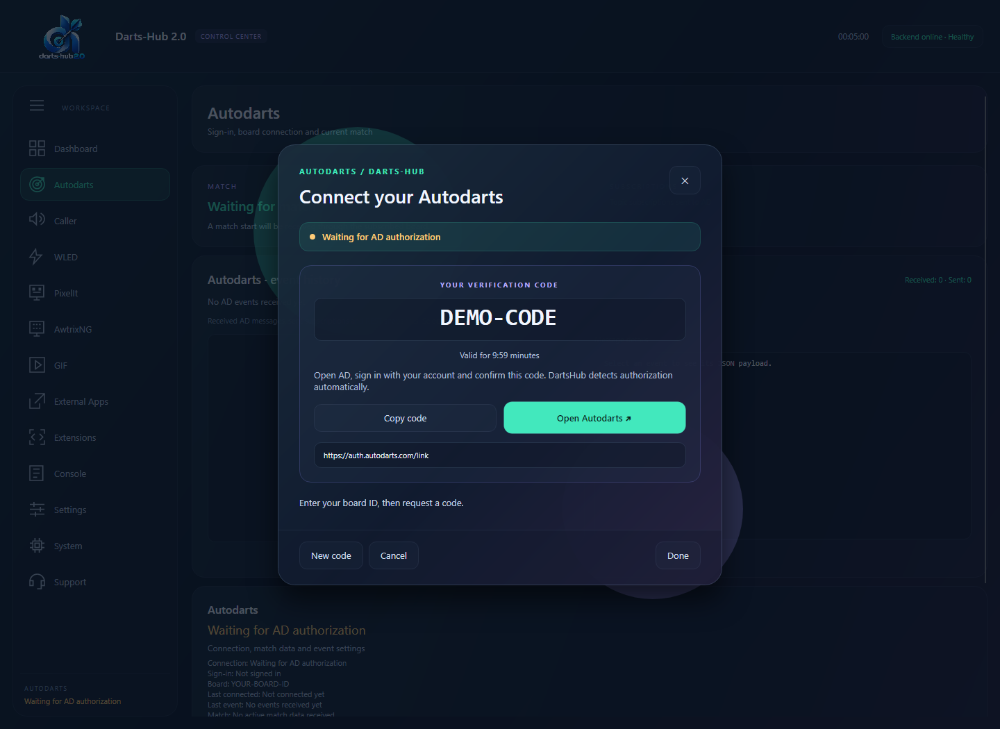

**The code in this screenshot is invalid.** Use the new code shown by your application. If it expires, start signing in again. Enter your Autodarts password on the Autodarts website.

Your sign-in and board ID are saved. Darts-Hub restores the connection at the next start while authorization remains valid. The Autodarts page also lets you inspect the match status and received events or sign out.

## 4. When do changes take effect?

| Action | Result |
| --- | --- |
| Edit a setting or effect | Creates a draft; saved values remain active. |
| **Save** | Caller, WLED and PixelIt apply the changes while running and retain them after restarting. |
| **Test / Preview** in WLED or PixelIt | Sends the current draft immediately without saving it. |
| Next matching game event | Uses the saved rule or effect. |

Saving does not automatically play the effect you are editing. Applying a new configuration may interrupt running effect sequences. Imported settings are saved and applied to running modules immediately.

## 5. Caller – voice announcements

Create custom voices and effects: [soundpack guide with all keys, triggers and examples](docs/CALLER_SOUNDPACKS.en.md).

1. Open **Caller** and enable it if you want announcements.
2. Find a language and voice in the soundpack library.
3. Use **Preview** to listen, download the pack and select it as your active voice.
4. Set the volume and announcements you want. Options are grouped by topic, with help texts explaining their purpose.
5. Save your changes.

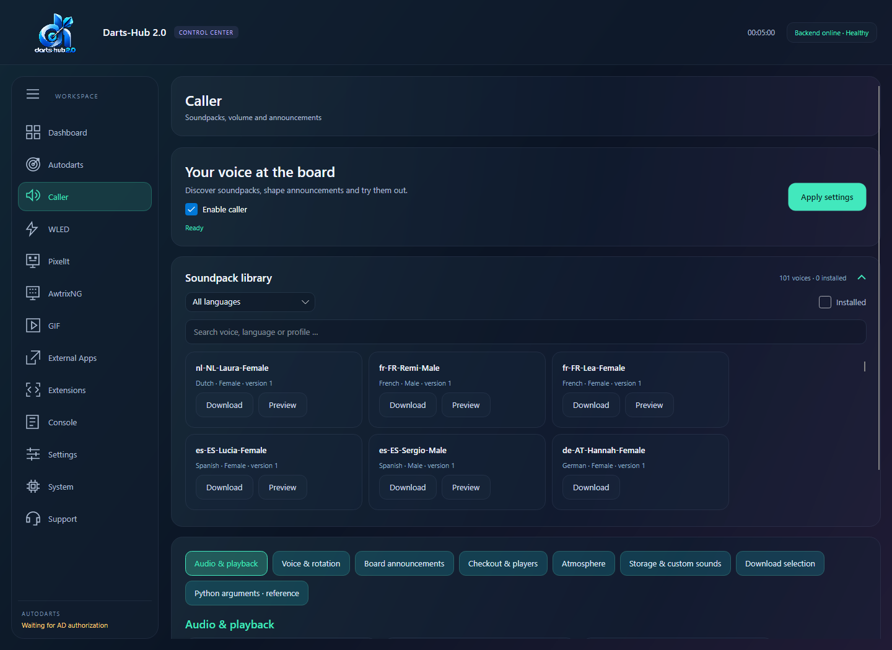

**TTS** generates speech in addition to the sound files. It is off by default and can be enabled when needed. If you only want lighting or displays, disable the Caller. Other extensions receive their game events directly from Autodarts.

A new dart replaces a single-dart announcement that is still playing. Turn totals, busts and winner announcements finish normally. If turn totals are enabled, the total takes priority after dart three. Ambient sounds play independently alongside announcements. This also applies to TUI and headless mode; no additional settings are needed.

## 6. WLED – lighting

Direct effects and colors always control all LEDs: DartsHub expands segment 0 to the entire strip and removes additional active segments. To control specific segments, use a preset saved in WLED; its segment layout is preserved when called.

### Add controllers

Open **WLED → Devices**, add a controller and enter a useful name and its address. Add further controllers as separate devices. Enable the devices and module you want, load the controller data or check the connection, and save.

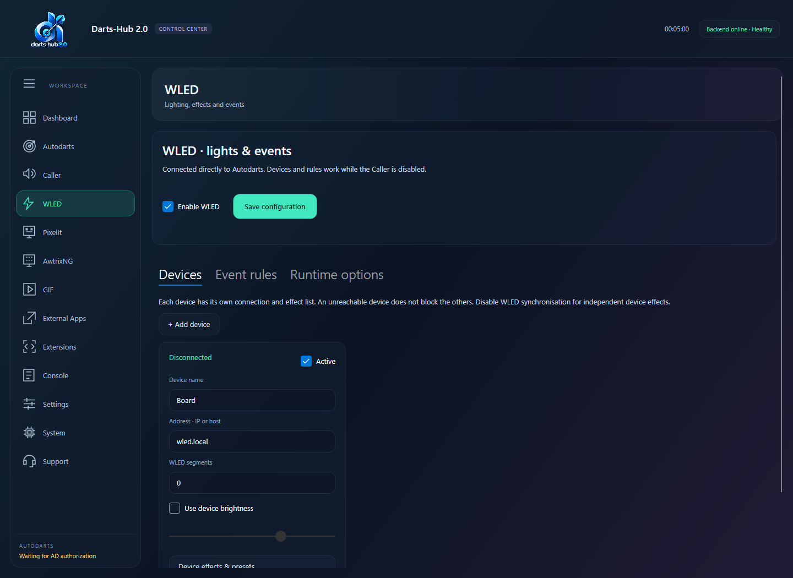

Effects, palettes and presets are loaded from the controller. If you change them in the WLED web interface, reload the controller data manually. Testing does not fetch the catalog again each time.

### Add an event rule

1. Open **Event rules** and add a rule.
2. Choose the trigger, such as idle, game start, 180, bust or a win.
3. Select the target devices. Optionally restrict the rule to a player; if you also specify a player position, both conditions must match.

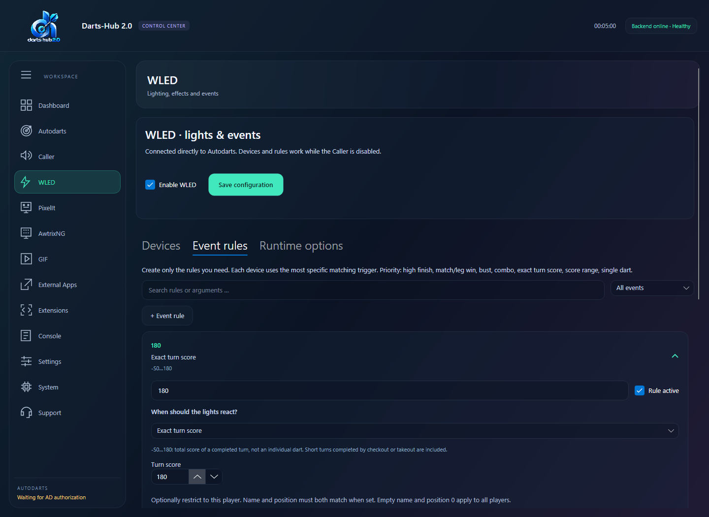

4. Choose **Effect** or **Preset**. Effects offer settings such as palette, supported colors, speed and intensity. A preset uses a scene saved on the controller.
5. Test the rule, then save it.

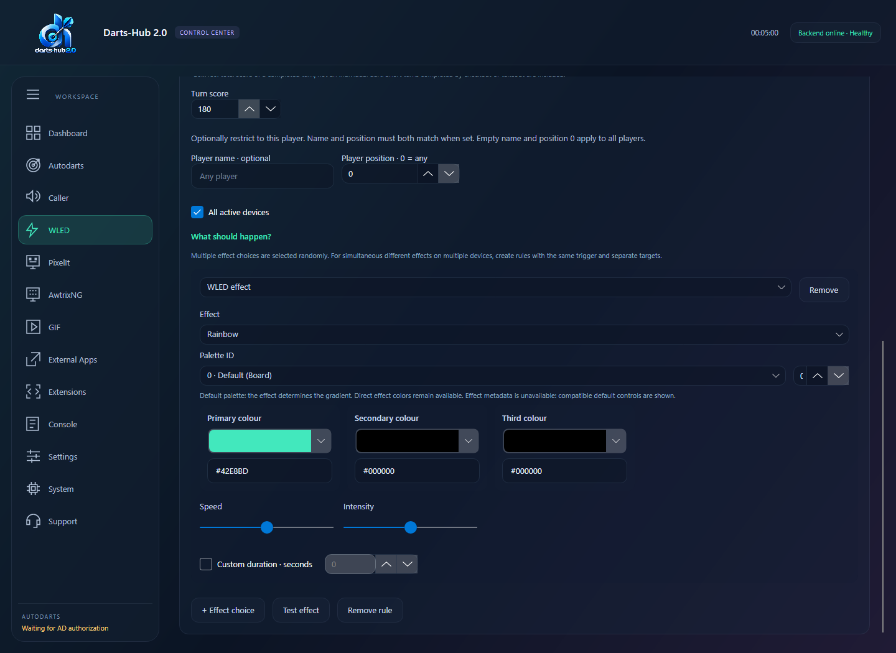

Tests control real devices. The sending indicator shows that a command is being processed. Some advanced features require an appropriate license.

## 7. PixelIt – displays and animations

In the **PixelIt** displays section, add one or more displays with a name and address. Enable the devices and module you want, test the connection and save.

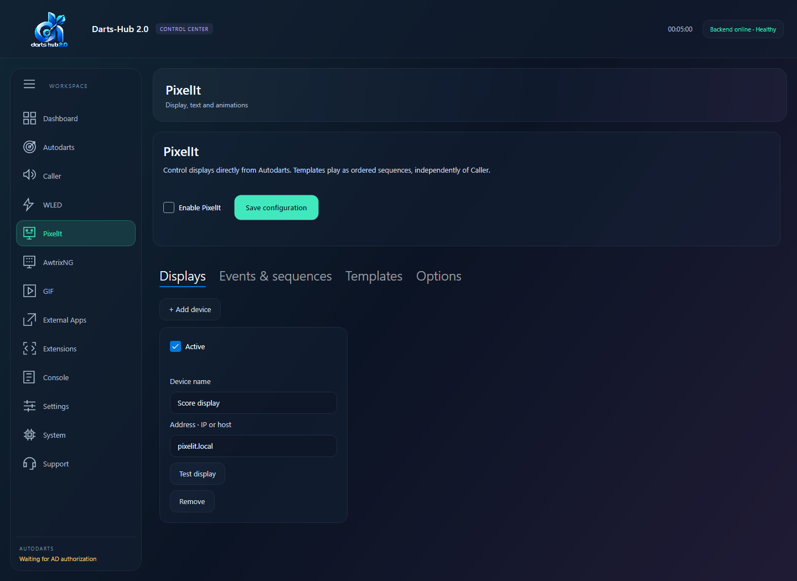

In **Events & sequences**, choose what to display when a game starts, a player scores 180 or someone wins:

1. Add a rule and choose its trigger. For scores, specify an exact value or a range.
2. Optionally restrict the rule to a player name.

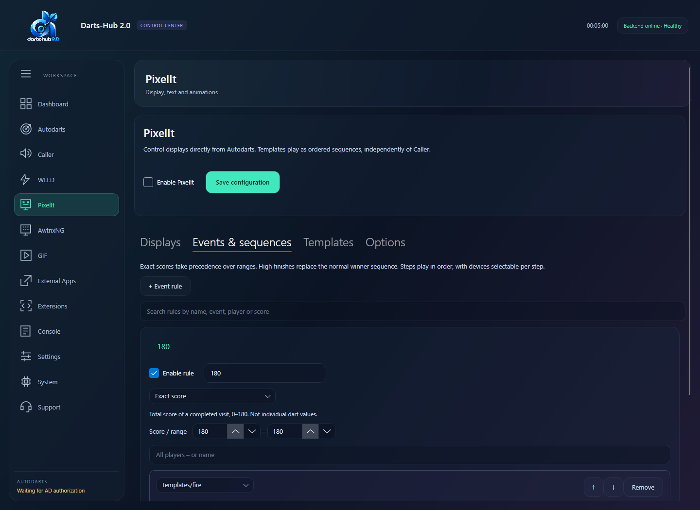

3. Add one or more steps and select a template for each step.
4. Optionally change text, brightness and delay. Use `{playername}` or `{score}` to insert the current player's name or score.
5. Choose target displays for each step and adjust their order if needed.
6. Test the sequence and save it.

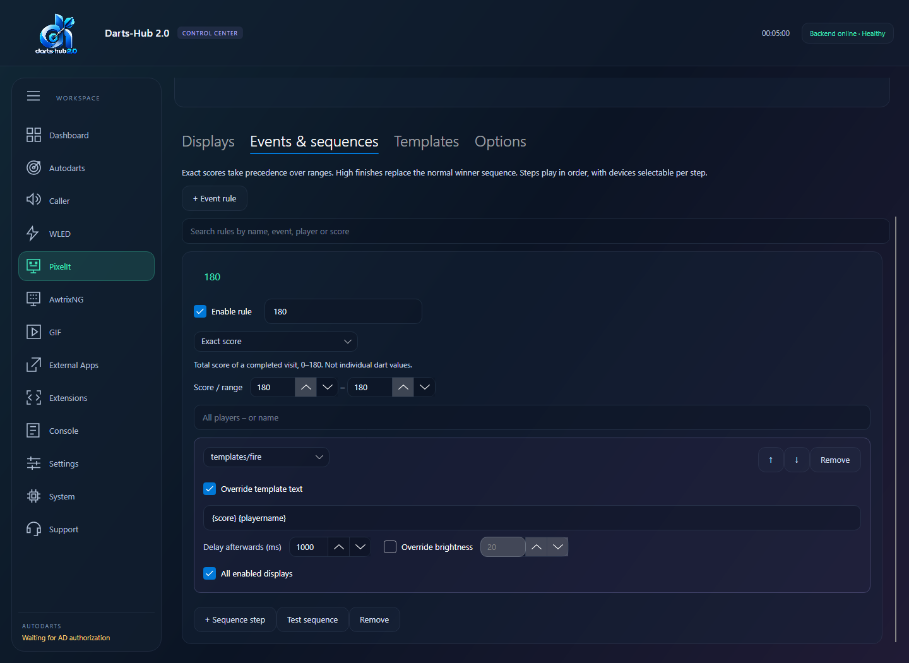

A score rule refers to a completed visit: the total of a player's turn. Ready-made templates are included. You can add your own using a template folder; save the folder and reload templates before testing them.

## 8. Settings, license and updates

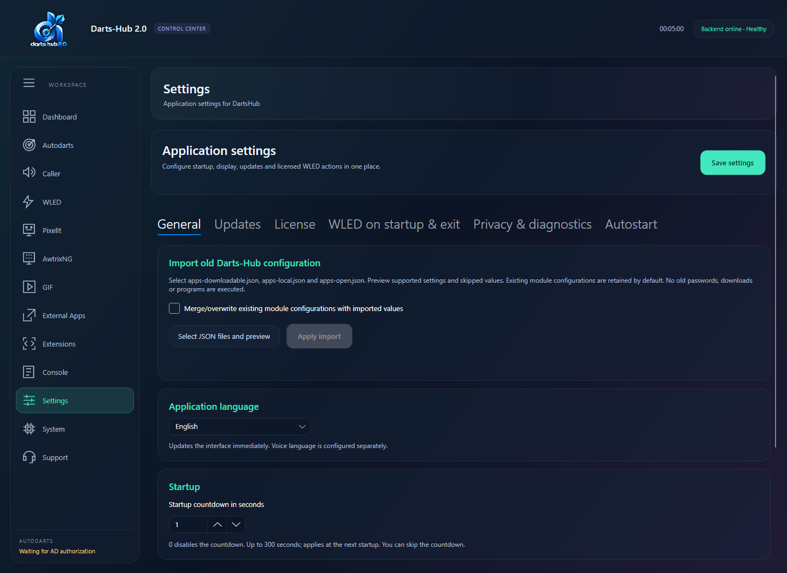

**Settings** contains language, startup behavior, updates, licensing and privacy. Enter your license key under **License** and validate it. Available features depend on your license; restricted options are marked accordingly.

Under **Updates**, check for new versions and optionally include beta releases. Read the displayed instructions and confirm an offered installation. Your settings are stored separately from the program; on Windows, they are in `%LOCALAPPDATA%\DartsHub`. Keep this folder to preserve your setup.

Under **Privacy & diagnostics**, read the telemetry notice and choose the offered minimal or full profile. No telemetry is collected or transmitted before you confirm a choice. “Decide later” postpones it. Switching off extended diagnostics changes to the minimal profile.

### Import old settings

Under **Settings → General → Import old Darts-Hub configuration**, select one or more files: `apps-downloadable.json`, `apps-local.json`, `apps-open.json`.

Review the preview and apply the import. Existing module configurations are kept by default; explicitly enable overwriting to replace them. The report lists unsupported or invalid values. The original files remain unchanged. **Restart Darts-Hub or its headless host afterwards.** Then check your devices and rules. You may still need to download the required soundpacks.

## 9. Console and troubleshooting

The **console** shows events and actions with timestamps. Filter by extension, severity or search text. Enable debug messages per extension when investigating a problem; they are hidden by default. Pausing freezes the display, not the application. Export messages as a `.log` file when needed.

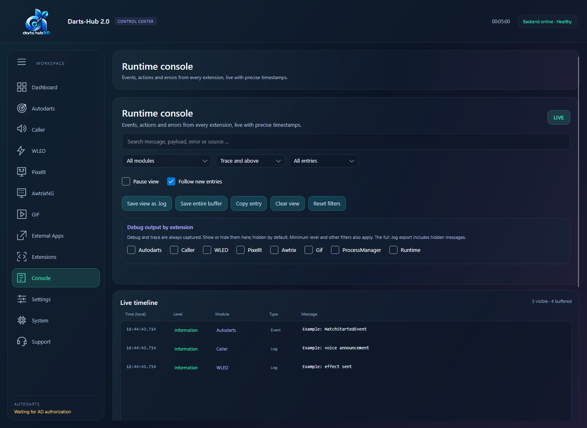

Showing complete Autodarts messages in the console and logs requires the corresponding license feature. Without it, the received event type is still logged.

| Problem | What to check |
| --- | --- |
| No match or reaction | Is Autodarts connected? Is the board ID correct? Are events arriving? |
| No voice announcements | Enable Caller, download and select a soundpack, check volume and audio output. |
| No lighting or display | Are devices reachable and enabled? Are the module and rule enabled? Are targets correct? Test manually. |
| Missing effect or preset | Reload WLED controller data manually. |
| Changes seem ineffective | Did you save? Does the event or player filter match? |
| Feature is locked | Check your license status and enabled features. |

### Send a support request

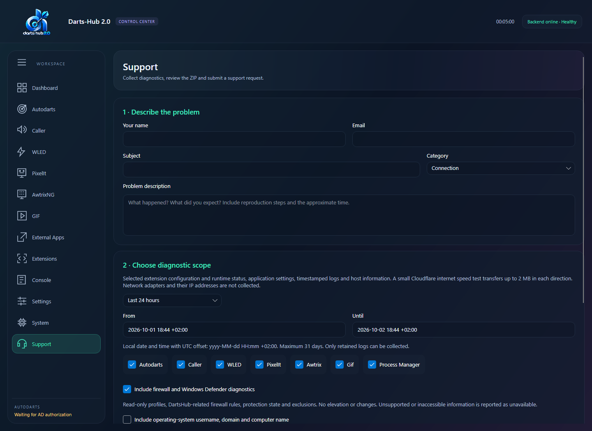

1. Open **Support** and enter your contact details, subject, category and description. Explain how to reproduce the problem.
2. Select the time period and affected extensions. Additional system/security details have their own selection controls.
3. Read the notices, give consent and choose **Collect diagnostics**. A progress indicator accompanies collection.
4. Review the file list. Save the ZIP locally to inspect it before sending.
5. Send the request and keep the displayed request ID. Collect again after changing the form.

The collection includes selected settings, logs and system information. Passwords and authentication keys are excluded or masked. Network adapters and IP/MAC addresses are not collected. The small internet speed test does not store an IP address. If uploading is unavailable, you can still save the diagnostic ZIP locally.

## 10. TUI and headless

**TUI** is an interactive interface in a terminal. **Headless** runs Darts-Hub without an interface. Both are included in the same application.

| Mode | Windows | Linux |
| --- | --- | --- |
| Terminal interface | `.\DartsHub.exe --tui` | `./DartsHub --tui` |
| Without an interface | `.\DartsHub.exe --headless` | `./DartsHub --headless` |

On macOS, replace `./DartsHub` with `./DartsHub.app/Contents/MacOS/DartsHub`.

Starting the TUI reuses an existing local host or automatically starts one if needed. An automatically started host stops with the TUI unless headless autostart is enabled. With autostart enabled, headless keeps running in the background after the TUI closes. Separately started hosts also keep running. On Windows, the TUI opens its own terminal window.

Use **Tab** to move between areas, **arrow keys** to select items, **Enter** to confirm and **Esc** to close dialogs. Navigation includes Autodarts, Caller, WLED, PixelIt, AwtrixNG, GIF, console, settings/license and support. Follow the same steps described above: edit, test, save. Importing settings and creating diagnostic ZIP files are available there too.

For continuous operation, start headless separately and open the TUI alongside it. Startup arguments can directly set configuration values:

```powershell
.\DartsHub.exe --headless --caller-enabled false --wled-enabled true
```

These values are saved. The included `start.bat` or `start.sh` files are editable examples; check their defaults before running them. `start-pixelit.bat` or `start-pixelit.sh` demonstrate a PixelIt setup. Use `--help` or the [argument reference](docs/START_ARGUMENTS.md) for all startup options.

**PixelIt** also previews templates and display steps in a virtual LED matrix. Text and brightness update immediately; bitmap graphics are read from the template. The TUI provides a preview in the display step. Animated templates show their first frame.

## 11. AwtrixNG and GIF

Both extensions receive events directly from Autodarts and work with Caller disabled. Connect your board first. Dashboard switches turn extensions on or off immediately. Changes inside their settings are applied with **Save**; **Test** uses current edits without saving them.

### Live display after each dart (PixelIt and AwtrixNG)

**One matrix for all players:** Create two rules: **After each dart** and **Player change**. Leave the player filter empty and target the same matrix in both rules. Enable **Replace template text** and enter, for example:

```text
{playername} {points-left} D{dart-number}
```

The display starts with the active player, updates after each dart and follows player changes. For a fast PixelIt display, set the pause after the step to 0.

**One matrix per player:** Use the same events and a fixed player number in each matrix's text, for example:

```text
{p1-playername} {p1-points-left} D{p1-darts-thrown}
```

Replace `p1` with `p2` on the second matrix, and so on. Numbers stay the same when the starting player changes. Leave the player filter empty to refresh values on every event. Target the appropriate matrix from each display step.

| Placeholder | Meaning |
| --- | --- |
| `{dart-score}` | Last dart score |
| `{dart-number}` | Dart number within the current visit (0–3) |
| `{darts-thrown}` | Darts thrown in the current leg |
| `{turn-score}` | Current visit score |
| `{points-left}` | Remaining score of the selected/active player |
| `{p1-points-left}`, `{p1-darts-thrown}` | Fixed values for player 1; likewise for p2 through p32 |

Corrections, undo and busts use the values reported by Autodarts. The TUI provides the same events and text fields. Headless configurations use the trigger IDs `Throw` and `PlayerChanged`.

### AwtrixNG: Connect a display

1. Open **AwtrixNG → Devices**, enable the extension and add a display.
2. Enter a name and its address, for example `awtrix.local`. Add an HTTP username and password if your display requires them.
3. Check the device. Its status shows whether it is reachable. Add further displays in the same way.
4. Save your settings. This extension requires **AwtrixNG firmware**; the older AWTRIX3 firmware uses a different interface.

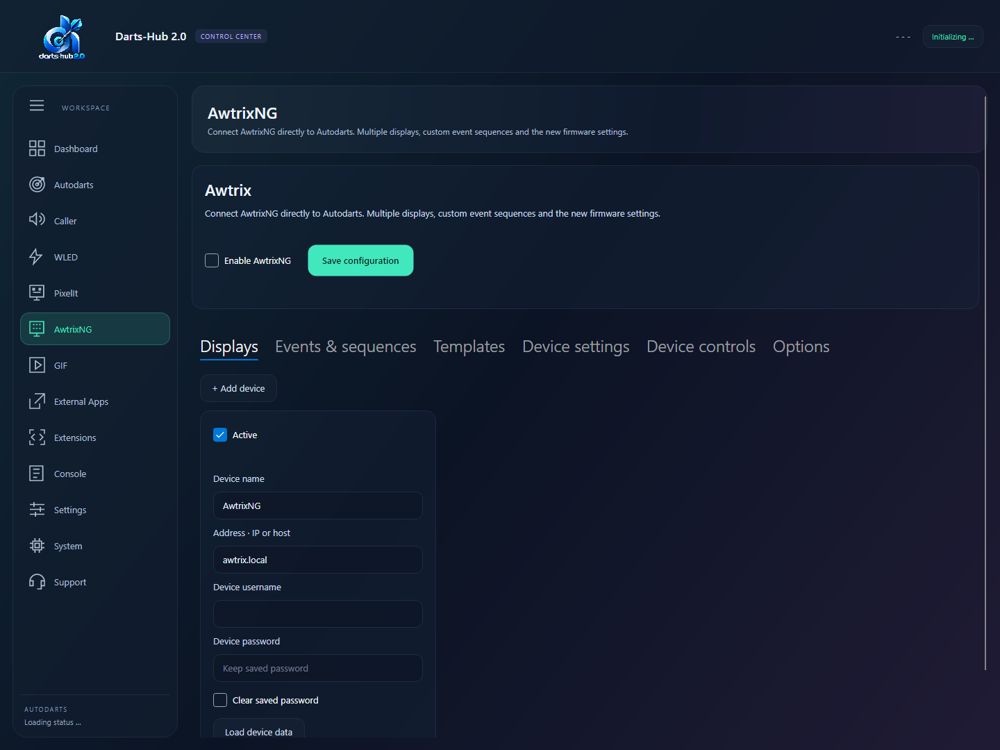

### AwtrixNG: React to an event

1. Open **Events**, add a rule and give it a name such as “180”.
2. Select the event and score where applicable. An empty player filter applies to all matching players.
3. Add a step and select a template, text and target devices. Use `{score}` and `{playername}` to insert the score and player name into your text.
4. Set an icon, color and duration if needed. Multiple steps run in order, and each step can target different displays.
5. Test the rule and save it. It will then react to matching Autodarts events.

Select the triggering event under **When to display?**. **Display template** determines only the appearance. New display steps automatically use a matching template. For existing steps, select **Use suggested template** to apply the suggestion; custom text is preserved. The TUI provides the same options in the event and display step editors.

The **virtual LED matrix** previews the template while editing, including custom text and colors. Long text scrolls. In the TUI, open the preview from the display step. The preview uses sample values; device icons and firmware effects may differ.

Choose text colors with the color picker or a hex value. Brightness and scroll speed update the local preview immediately. The TUI offers preset colors and custom hex values.

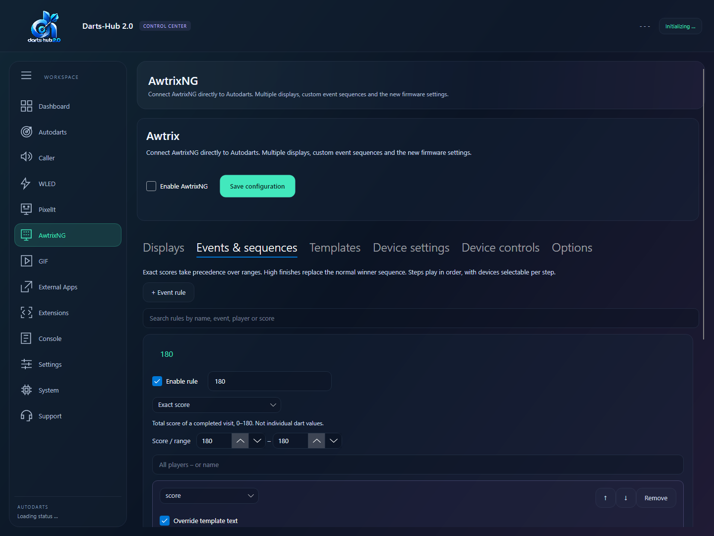

Under **Display settings**, configure brightness, text and screen transitions. Enable only values you want Darts-Hub to override; the other values remain on the display. Each setting includes help.

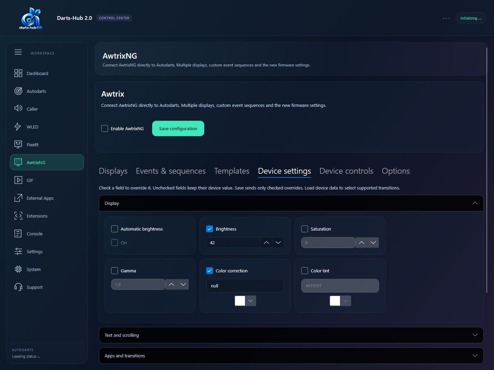

Under **Device control**, turn the display on or off, change the screen and stop audio. Advanced actions are for device management; event rules are sufficient for normal gameplay.

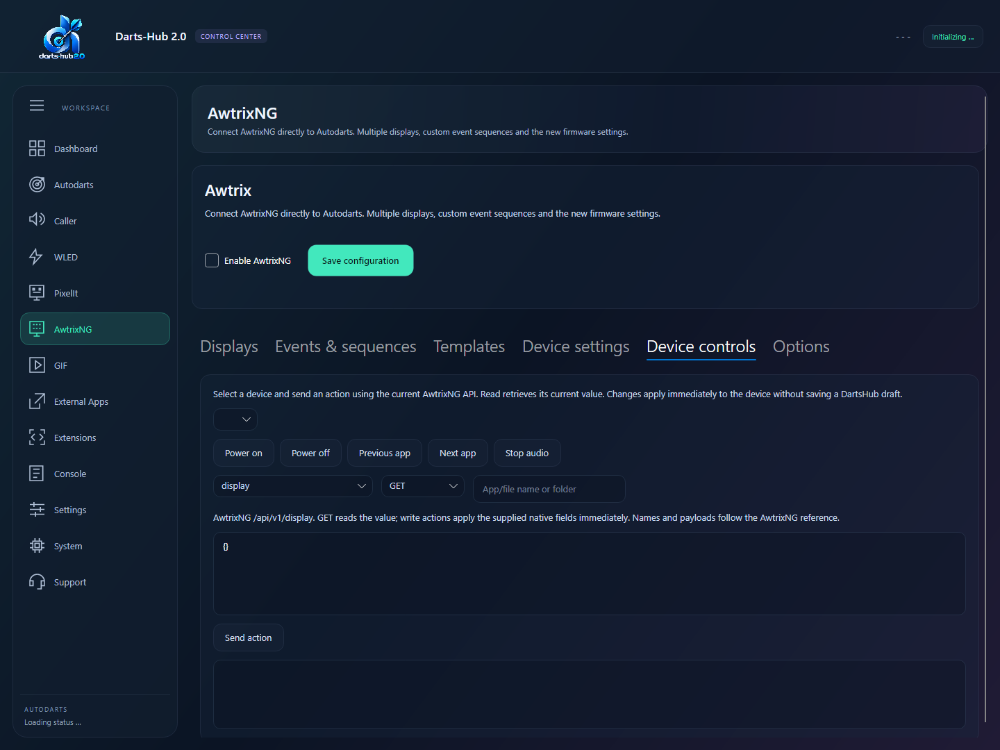

### GIF: Prepare your images

1. Put your GIF, PNG or JPEG files in a folder, for example `C:\DartsHub\Media`.
2. Open **GIF → Media**, enter that folder and save. The file list shows the images found there.
3. Local files do not need online search. To use a direct public HTTPS image address or a search, choose that source when editing the rule.

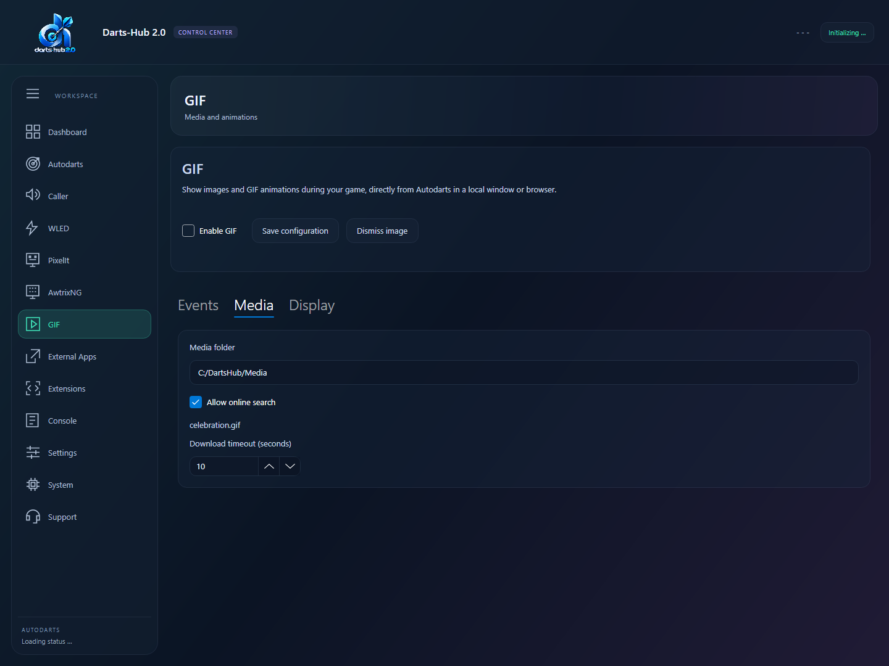

### GIF: Test an image rule

1. Open **Events**, enable GIF and add a rule, for example for 180 points, bust or a game win.
2. Choose **Local file** and enter a filename such as `celebration.gif`. Add a player filter if needed.
3. Set a duration in seconds. **Duration 0** keeps the image visible until darts are removed.
4. Test the rule and save. Multiple images within one rule are random alternatives, not a sequence. **Dismiss image** immediately clears the current display.

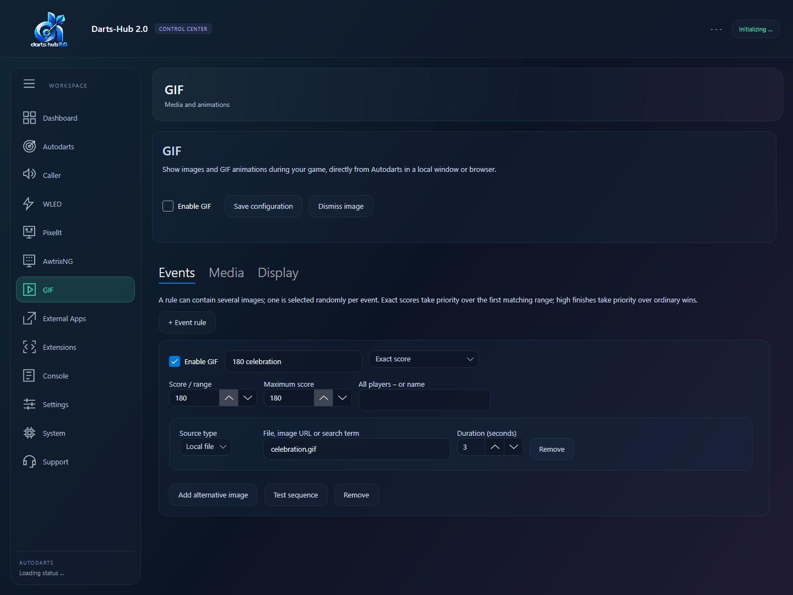

Under **Display**, choose the application window, browser or both. The application window supports monitor selection, fullscreen and always-on-top. **Headless needs browser display**: save browser mode and open the displayed address. Double-click the browser display for fullscreen. If you enable network access, keep the display URL and its access key private.

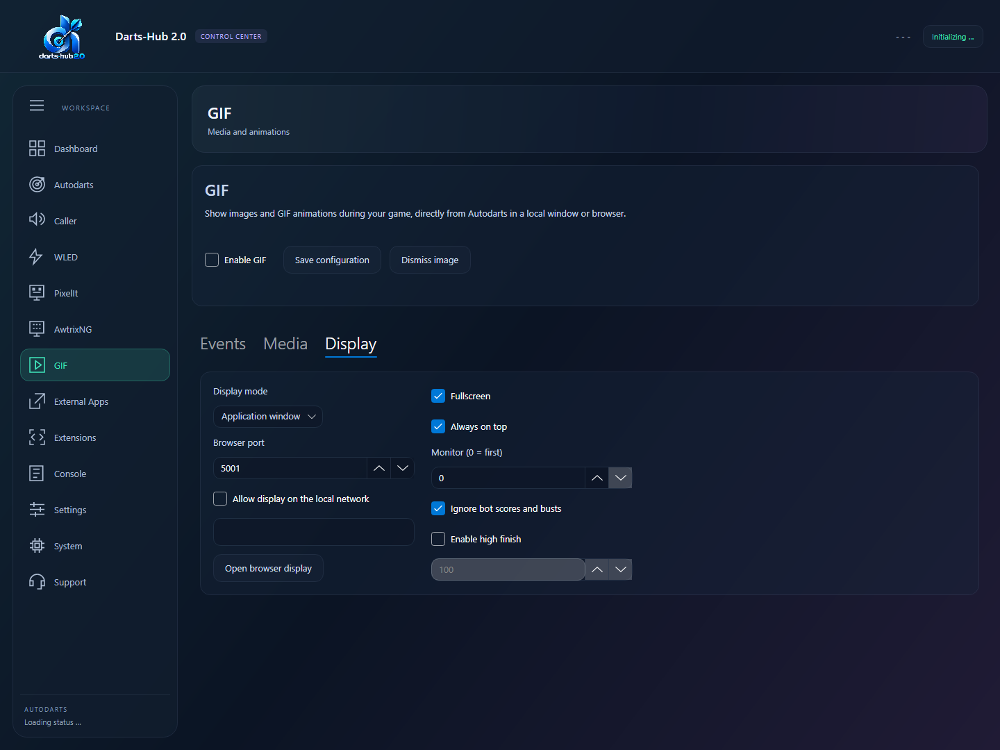

No reaction? Check the Autodarts connection, extension switch, enabled rule, player filter, and target device or filename. The console shows events and errors; you can reveal debug messages per extension.

The TUI provides the same settings and previews on its **AwtrixNG** and **GIF** pages. Press **Enter** to open a setting, then test and save as in the GUI. Quick guides: [AwtrixNG](docs/AWTRIX.md) · [GIF](docs/GIF.md).

## 12. Automatic startup and background operation

**Settings → Autostart** can start the GUI at login, optionally minimized. The TUI can enable headless autostart or a user service. Headless then keeps running after the TUI closes. **Stop headless** stops the current host; disable autostart too if you want to prevent future starts.

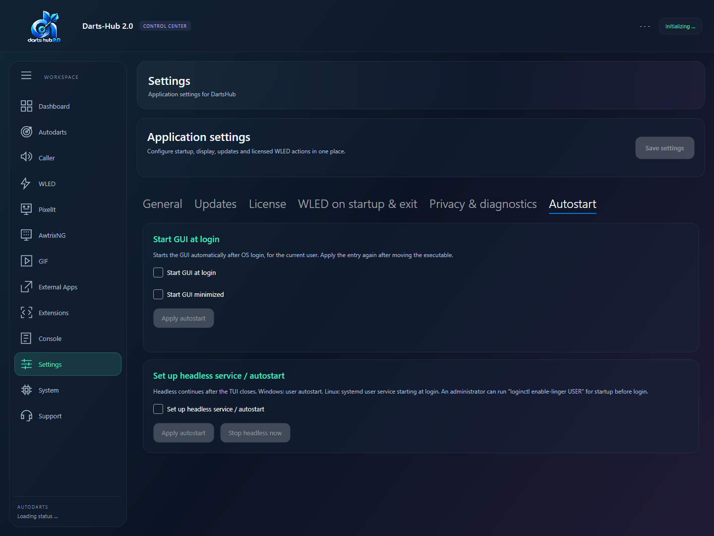

Linux uses a systemd user service. Running before login may need a one-time administrator step. See [Autostart](docs/AUTOSTART.md).

More detail when needed: [WLED](docs/WLED_CONFIGURATION_AND_AUTODARTS.md), [PixelIt](docs/PIXELIT.md), [terminal usage](docs/TUI.md).

## 13. Start your own applications and scripts

Open **Own applications**, add an entry, choose its file and arguments, and enable **Start with DartsHub**. Then select **Save and apply**.

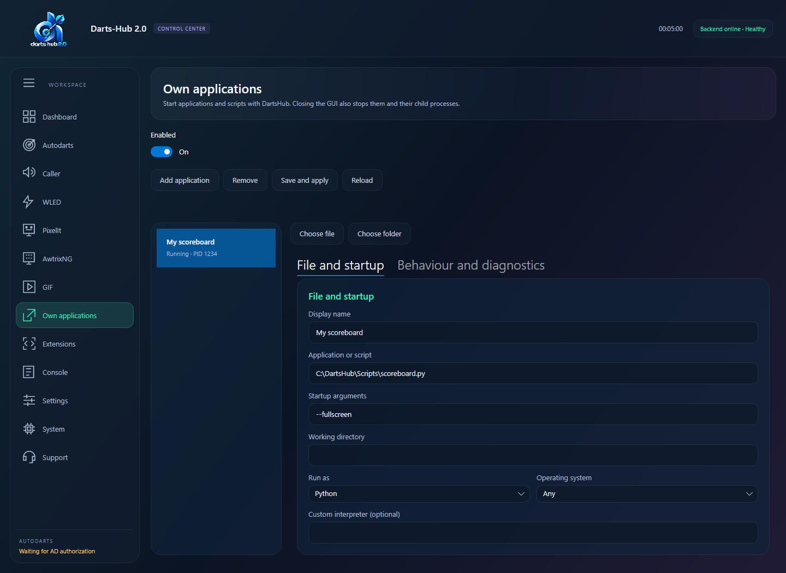

Each saved entry appears on the dashboard with its actual status and **Start**, **Stop** and **Restart** actions. Closing the GUI stops applications started by DartsHub, including their child processes. Settings remain saved for the next launch.

The TUI has the same **Own applications** page. Headless uses the saved settings. Examples and startup options: [Own applications](docs/OWN_APPLICATIONS.md).

The startup delay in **Settings** holds back module initialization, own autostart applications and the update check. **Start now** releases the startup early. The TUI provides the same countdown; headless also waits. Attaching another frontend to an already running host does not restart the delay.

When a new version is available, an update dialog shows its release notes after the startup countdown. Choose **Later** to postpone it; reopen it through Settings → Updates → **View update**. Release notes are also available in the TUI update settings.
## Raspberry Pi

See the [Raspberry Pi guide](docs/RASPBERRY_PI.md) for 64-bit Raspberry Pi OS, architecture detection and Caller audio setup.

### Event templates

Templates include a custom description of their trigger and output. Open the library in the extension’s **Events and sequences** tab.

Open **Event templates** in WLED, PixelIt or Awtrix to save an existing rule under a name or load a template as a new rule. Matching names are replaced. Conditions, effects, colours, steps and target selection are retained. Check targets and save the extension afterwards. Missing target devices disable the loaded rule.

The TUI provides the same actions under **Event templates**. Save WLED rules through “Configure WLED” afterwards. `event-templates/wled.json`, `pixelit.json` and `awtrix.json` sit beside the application and include examples. Back up or copy these files to reuse your library. The application directory must be writable.

The console keeps search and filters visible while scrolling. Use **Ctrl/click** for multiple messages, **Shift/click** for a range and **Ctrl+A** for all filtered messages. **Ctrl+C** or **Copy selection** copies selected messages with timestamps; **Include details / payloads** adds available details. Selection stops automatic following; enable **Follow new entries** to resume. Debug switches and additional actions open in menus. The TUI can open all filtered messages or a row range together in the text view for copying.

Headless login only needs `--board-id "YOUR-BOARD-ID" --ad-login`. Additional internal authentication parameters are not required.

On first launch, DartsHub uses the OS language (German or English, otherwise English). A language selected by the user persists across restarts. The console context menu offers **Copy messages only** and **Copy messages with details / payloads** for the entire selection.

Normal score, score-range and combination effects run after the third dart. Bust, wins and lifecycle events are exceptions. WLED single-dart rules (DartScore/DS, DartField and Multiplier/DMU) and explicit Throw displays remain immediate. The same timing applies to TUI and headless configurations.

Logs are stored under `logs`: `DartsHub_04.log` for all messages and, for example, `Caller/Caller_04.log` for Caller messages. Restarts on the same day append messages. The same calendar day next month starts a fresh file; file size is unlimited.
