# Darts-Hub 2.0 – Benutzeranleitung

Online installieren: Der [Online-Installer](docs/ONLINE_INSTALLER.md) erkennt dein System und fragt nach GUI, TUI oder Headless sowie Autostart.


**Deutsch** · [English](README.en.md)

Darts-Hub verbindet dein Autodarts-Board mit Sprachansagen, WLED-Beleuchtung und PixelIt-Anzeigen. Du entscheidest, welche Erweiterungen du nutzen möchtest. WLED und PixelIt funktionieren auch bei ausgeschaltetem Caller.

## Bedienung im Browser

Während GUI oder Headless laufen, erreichst du Darts-Hub im lokalen Netzwerk unter `http://IP-DES-RECHNERS:8079`. Den Zugangscode findest du unter **Einstellungen / Lizenz → Weboberfläche**, in der TUI oder beim Headless-Start im Terminal. [Anleitung zur Weboberfläche](docs/WEB_INTERFACE.md).

## Schnellstart

1. Lade das Paket für dein Betriebssystem herunter und entpacke es vollständig.
2. Starte **DartsHub**.
3. Melde dich unter **Autodarts** an und hinterlege deine Board-ID.
4. Richte die gewünschten Erweiterungen ein und speichere ihre Einstellungen.
5. Starte ein Spiel in Autodarts. Dashboard und Konsole zeigen, was passiert.

Die Bilder zeigen die tatsächliche Oberfläche mit **Beispieldaten**. Adressen, Status und `DEMO-CODE` dienen nur zur Erklärung; verwende deine eigenen Daten. Je nach Fenstergröße musst du für weitere Einstellungen nach unten scrollen.

## 1. Herunterladen und starten

Wähle **Windows**, **Linux** oder **macOS** und die passende Architektur: **x64** für die meisten Intel-/AMD-Rechner, **ARM64** für ARM-Geräte, etwa Macs mit Apple-Chip. Verwende eine stabile Version für den normalen Betrieb. Beta-Versionen enthalten Neuerungen, können aber noch Fehler haben.

| Betriebssystem | Start |
| --- | --- |
| Windows | Doppelklick auf `DartsHub.exe` |
| Linux | Im entpackten Ordner `./DartsHub` ausführen |
| macOS | `DartsHub.app` öffnen |

Du musst keine zusätzliche API oder andere DartsHub-Programme starten. Eine separate .NET-Installation ist bei den Release-Paketen nicht erforderlich. Controller und Anzeigen müssen vom Rechner aus erreichbar sein. Für Anmeldung und Downloads benötigst du Internet.

## 2. Die Oberfläche

Das linke Menü führt zu Dashboard, Autodarts, Erweiterungen, Konsole, Einstellungen und Support. Mit der Menüschaltfläche klappst du es ein; die Symbole bleiben anklickbar. Halte den Mauszeiger über ein Symbol oder eine Einstellung, um die Erklärung zu lesen.

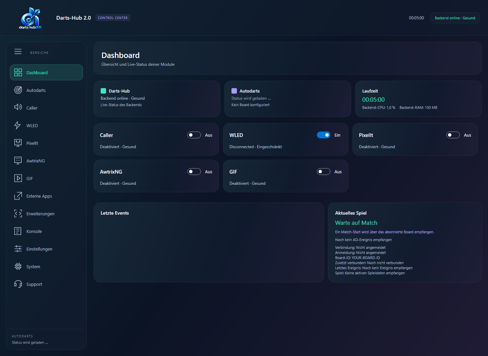

Mit den Schaltern auf den Erweiterungskarten schaltest du Caller, WLED, PixelIt, AwtrixNG und GIF sofort ein oder aus. Der Zustand wird gespeichert; Geräte und Ereignisregeln bleiben erhalten. Während der Übernahme zeigt die Karte eine Animation.

Das **Dashboard** zeigt Verbindung, Spiel und Zustand der Erweiterungen. „Nicht verbunden“ oder „Deaktiviert“ ist erwartbar, wenn du eine Erweiterung nicht verwendest. Direkt nach dem Start können Statusangaben noch auf ihre erste Aktualisierung warten.

Unter **Einstellungen → Allgemein** wechselst du zwischen Deutsch und Englisch.

## 3. Autodarts anmelden

1. Öffne **Autodarts** und den Anmeldedialog.
2. Trage deine **Board-ID** ein. Du findest sie in Autodarts bei deinem Board beziehungsweise in dessen Board-Link.
3. Starte die Anmeldung. Die Anwendung erledigt die technischen Anmeldedaten automatisch.

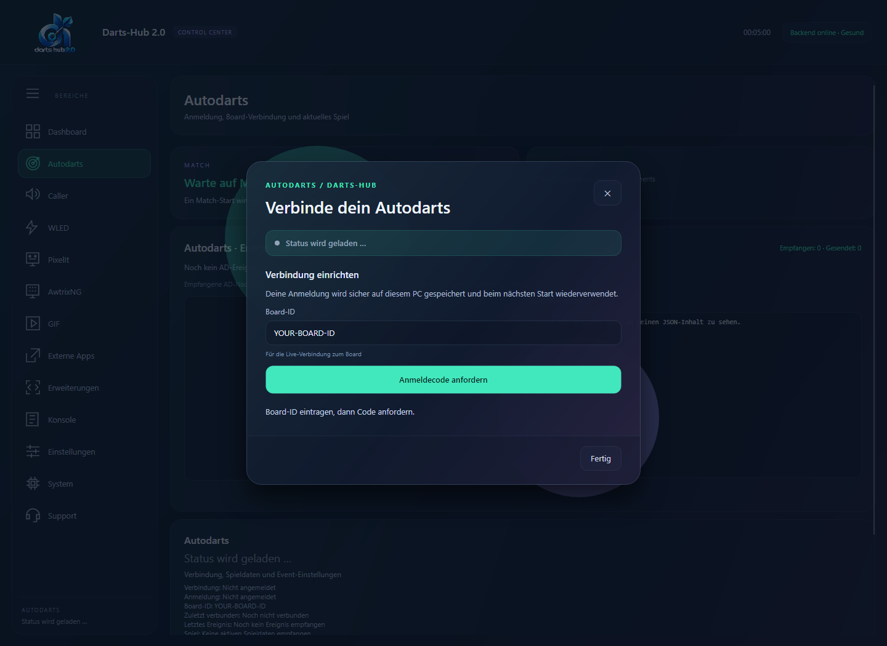

4. Darts-Hub zeigt einen **Anmeldecode** und die Verifikationsseite. Öffne diese Seite, melde dich bei Autodarts an und bestätige den angezeigten Code.
5. Warte, bis Darts-Hub die Freigabe erkennt und die Verbindung anzeigt. Speichere geänderte Autodarts-Einstellungen mit der vorgesehenen Schaltfläche.

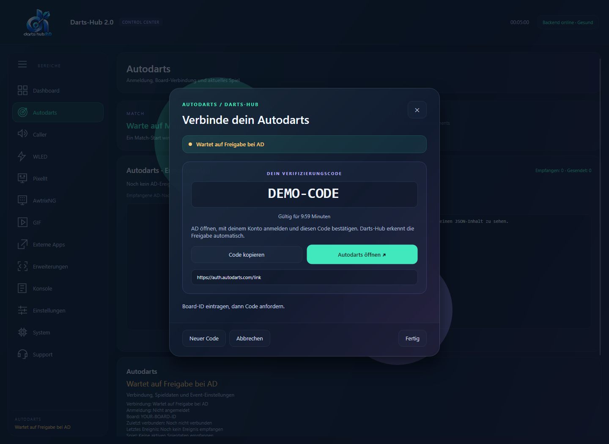

**Der Code im Bild ist ungültig.** Verwende den frisch erzeugten Code deiner Anwendung. Ist er abgelaufen, starte die Anmeldung erneut. Dein Autodarts-Passwort gibst du auf der Autodarts-Seite ein.

Anmeldung und Board-ID bleiben gespeichert. Beim nächsten Start wird die Verbindung wiederhergestellt, solange die Freigabe gültig ist. In der Autodarts-Ansicht kannst du außerdem Match-Status und empfangene Ereignisse prüfen oder dich abmelden.

## 4. Wann gelten Änderungen?

| Aktion | Wirkung |
| --- | --- |
| Felder oder Effekte ändern | Zunächst ein Entwurf; die gespeicherten Werte bleiben aktiv. |
| **Speichern** | Caller, WLED und PixelIt übernehmen die Werte im laufenden Betrieb und behalten sie nach einem Neustart. |
| **Testen / Vorschau** bei WLED oder PixelIt | Sendet den aktuellen Entwurf sofort, ohne ihn zu speichern. |
| Nächstes passendes Spielereignis | Verwendet die gespeicherte Regel beziehungsweise den gespeicherten Effekt. |

Speichern löst nicht automatisch den bearbeiteten Effekt aus. Laufende Effektfolgen können beim Übernehmen einer neuen Konfiguration unterbrochen werden. Nach einem Import alter Einstellungen ist ein Neustart nötig.

## 5. Caller – Sprachansagen

Eigene Stimmen und Effekte erstellen: [Soundpack-Anleitung mit allen Keys, Auslösern und Beispielen](docs/CALLER_SOUNDPACKS.de.md).

1. Öffne **Caller** und aktiviere ihn, wenn du Ansagen möchtest.
2. Suche in der Soundpack-Bibliothek eine Sprache und Stimme aus.
3. Höre mit **Vorschau** hinein, lade das gewünschte Paket herunter und wähle es als aktive Stimme aus.
4. Stelle Lautstärke und gewünschte Ansagen ein. Die Optionen sind nach Themen gruppiert; Hilfetexte erklären ihre Wirkung.
5. Speichere deine Änderungen.

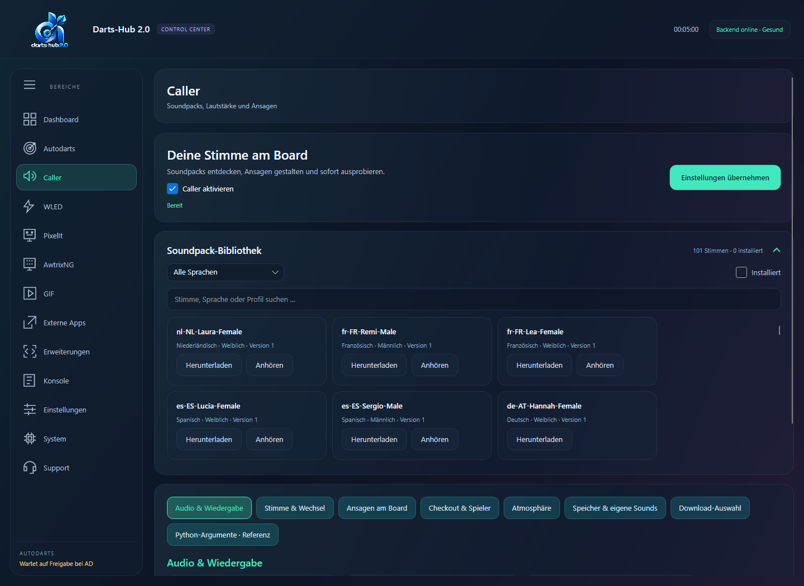

**TTS** erzeugt Sprache zusätzlich zu den Sounddateien. Es ist standardmäßig ausgeschaltet und kann bei Bedarf aktiviert werden. Möchtest du nur Beleuchtung oder Anzeigen, schalte den Caller aus. Die anderen Erweiterungen erhalten ihre Spielereignisse direkt von Autodarts.

Ein neuer Dart ersetzt eine noch laufende Einzelwurfansage. Gesamtscore, Bust und Siegeransagen werden zu Ende gesprochen. Ist der Gesamtscore aktiviert, hat er nach dem dritten Dart Vorrang. Ambient-Sounds laufen unabhängig parallel zu den Ansagen. Das gilt auch in TUI und Headless; zusätzliche Einstellungen sind nicht erforderlich.

## 6. WLED – Beleuchtung

Direkte Effekte und Farben steuern immer alle LEDs: DartsHub setzt Segment 0 auf den gesamten Streifen und entfernt weitere aktive Segmente. Für bestimmte Segmente verwende ein in WLED gespeichertes Preset; dessen Segmentaufteilung bleibt beim Aufruf erhalten.

### Controller hinzufügen

Öffne **WLED → Geräte**, füge einen Controller hinzu und trage einen verständlichen Namen sowie seine Adresse ein. Weitere Controller legst du als eigene Geräte an. Aktiviere die gewünschten Geräte und das Modul, lade die Controllerdaten beziehungsweise prüfe die Verbindung und speichere.

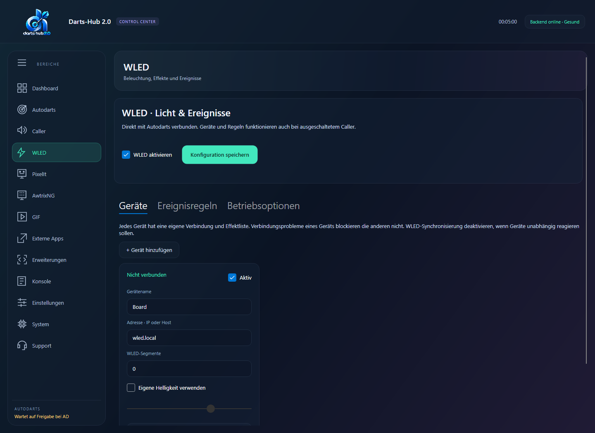

Effekte, Paletten und Presets werden vom Controller geladen. Wenn du sie im WLED-Webinterface geändert hast, lade die Controllerdaten manuell neu. Beim Testen werden sie nicht jedes Mal erneut abgefragt.

### Ereignisregel anlegen

1. Öffne **Ereignisregeln** und lege eine Regel an.
2. Wähle den Anlass, etwa Ruhemodus, Spielstart, 180, Bust oder Sieg.
3. Wähle die Zielgeräte. Beschränke die Regel bei Bedarf auf einen Spieler; bei einer zusätzlichen Spielerposition müssen beide Angaben passen.

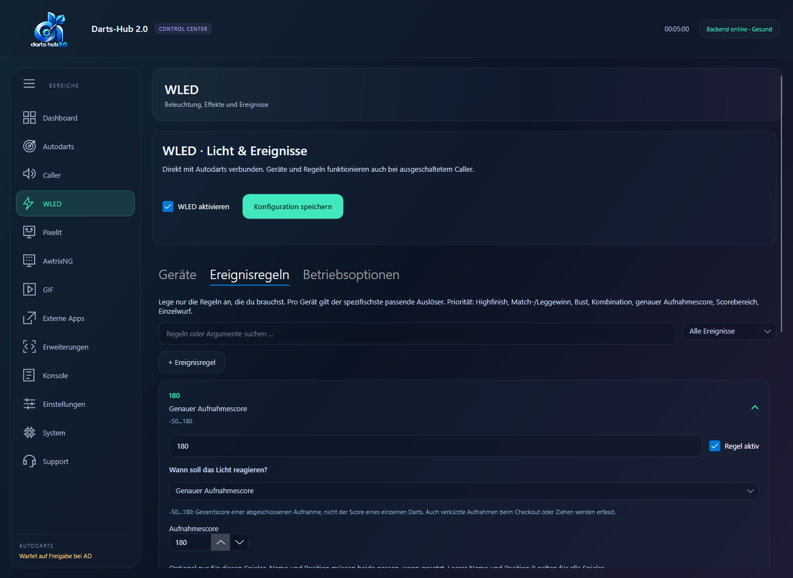

4. Wähle **Effekt** oder **Preset**. Beim Effekt kannst du Palette, angebotene Farben, Geschwindigkeit und Intensität einstellen. Ein Preset verwendet die auf dem Controller gespeicherte Szene.
5. Teste die Regel und speichere sie anschließend.

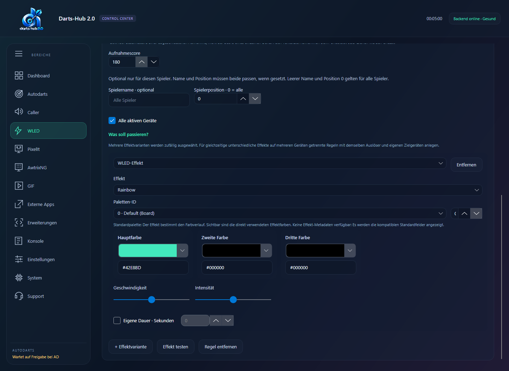

Der Test steuert echte Geräte an. Der Sendeindikator zeigt, dass der Befehl bearbeitet wird. Einzelne erweiterte Funktionen können eine passende Lizenz benötigen.

## 7. PixelIt – Anzeigen und Animationen

Im Gerätebereich von **PixelIt** fügst du eine oder mehrere Anzeigen mit Name und Adresse hinzu. Aktiviere die gewünschten Geräte und das Modul. Teste die Erreichbarkeit und speichere.

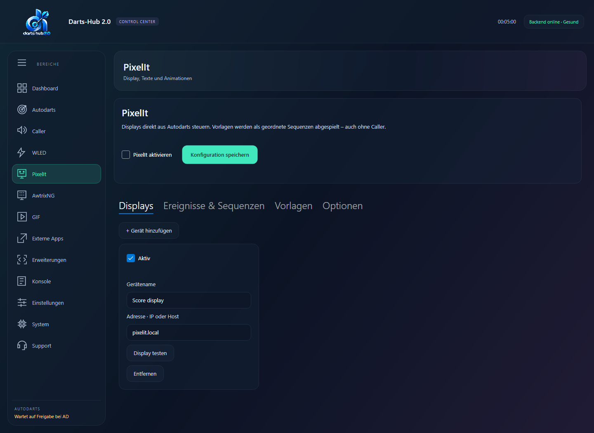

Unter **Ereignisse & Abläufe** legst du fest, was beispielsweise bei einem Spielstart, einer 180 oder einem Sieg angezeigt wird:

1. Lege eine Regel an und wähle das Ereignis. Bei Punktzahlen kannst du einen Einzelwert oder einen Bereich angeben.
2. Beschränke die Regel optional auf einen Spielernamen.

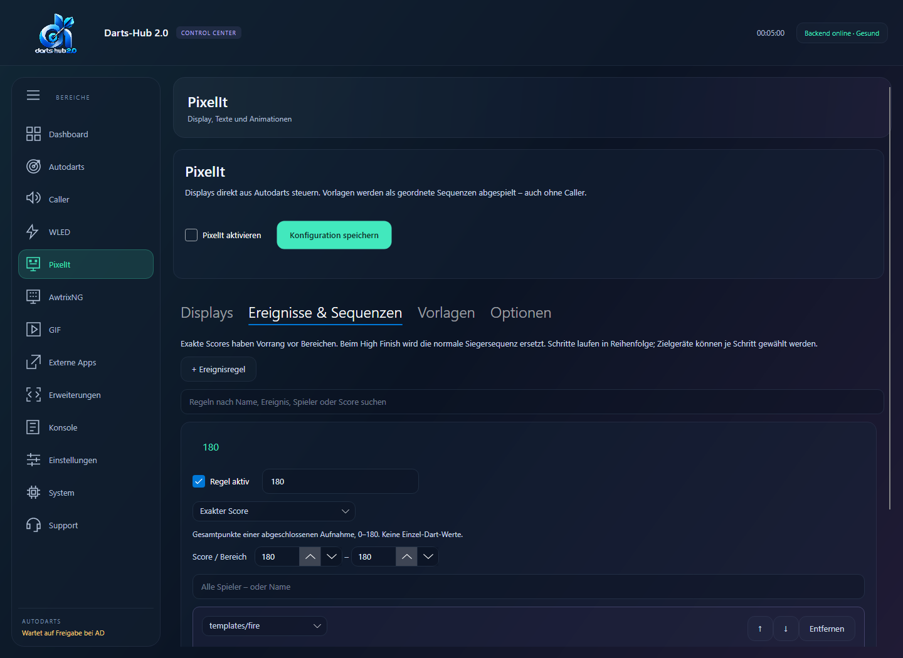

3. Füge einen oder mehrere Schritte hinzu und wähle je Schritt eine Vorlage.
4. Passe optional Text, Helligkeit und Wartezeit an. Mit `{playername}` oder `{score}` setzt du den aktuellen Spielernamen oder die Punktzahl ein.
5. Bestimme die Zielanzeigen je Schritt und ändere bei Bedarf die Reihenfolge.
6. Teste den Ablauf und speichere ihn.

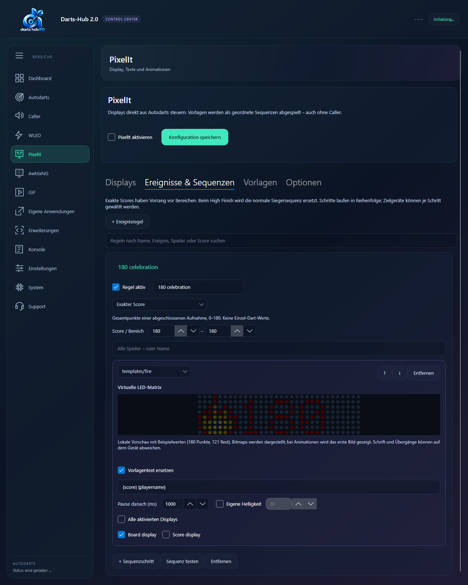

Eine Punktzahl-Regel bezieht sich auf die abgeschlossene Aufnahme, also die Summe eines Spielzugs. Fertige Vorlagen sind enthalten. Eigene Vorlagen kannst du über einen Vorlagenordner ergänzen; speichere den Ordner und lade die Vorlagen neu, bevor du sie testest.

## 8. Einstellungen, Lizenz und Updates

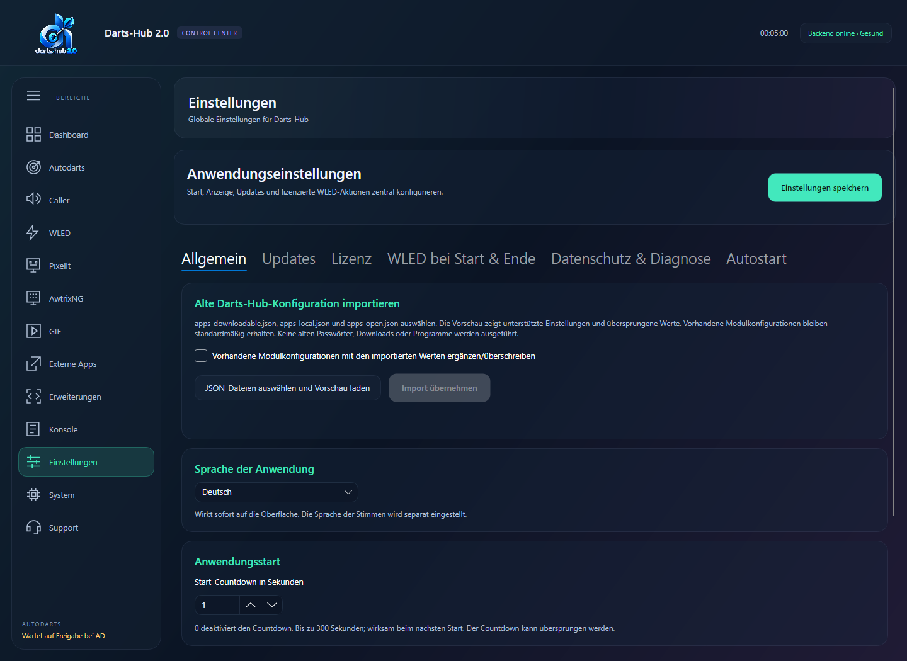

In **Einstellungen** findest du Sprache, Startverhalten, Updates, Lizenz und Datenschutz. Trage unter **Lizenz** deinen Lizenzschlüssel ein und lasse ihn prüfen. Freigeschaltete Funktionen hängen von deiner Lizenz ab; gesperrte Optionen werden entsprechend angezeigt.

Bei **Updates** kannst du nach neuen Versionen suchen und auf Wunsch Beta-Versionen berücksichtigen. Lies die angezeigten Hinweise und bestätige eine angebotene Installation. Deine Einstellungen liegen getrennt vom Programm; unter Windows in `%LOCALAPPDATA%\DartsHub`. Lösche diesen Ordner nicht, wenn du deine Einrichtung behalten möchtest.

Unter **Datenschutz & Diagnose** kannst du den Telemetriehinweis lesen und das angebotene Minimal- oder Vollprofil wählen. Ohne bestätigte Entscheidung werden keine Telemetriedaten erhoben oder übertragen. „Später entscheiden“ verschiebt die Auswahl. Das Ausschalten der erweiterten Diagnose wechselt zum Minimalprofil.

### Alte Einstellungen übernehmen

Unter **Einstellungen → Allgemein → Alte Darts-Hub-Konfiguration importieren** wählst du eine oder mehrere Dateien: `apps-downloadable.json`, `apps-local.json`, `apps-open.json`.

Prüfe die Vorschau und übernimm den Import. Vorhandene Modulkonfigurationen bleiben standardmäßig erhalten; zum Ersetzen musst du die Überschreiboption bewusst wählen. Nicht unterstützte oder ungültige Werte werden im Bericht genannt. Die Originaldateien bleiben unverändert. **Starte danach Darts-Hub beziehungsweise den Headless-Host neu.** Prüfe anschließend Geräte und Regeln; benötigte Soundpacks musst du gegebenenfalls noch herunterladen.

## 9. Konsole und Hilfe bei Problemen

Die **Konsole** zeigt Ereignisse und Aktionen mit Zeitstempel. Filtere nach Erweiterung, Schweregrad oder Suchtext. Für die Fehlersuche kannst du Debug-Meldungen je Erweiterung einblenden; standardmäßig sind sie ausgeblendet. Pausieren hält die Anzeige an, nicht die Anwendung. Du kannst Meldungen als `.log` exportieren.

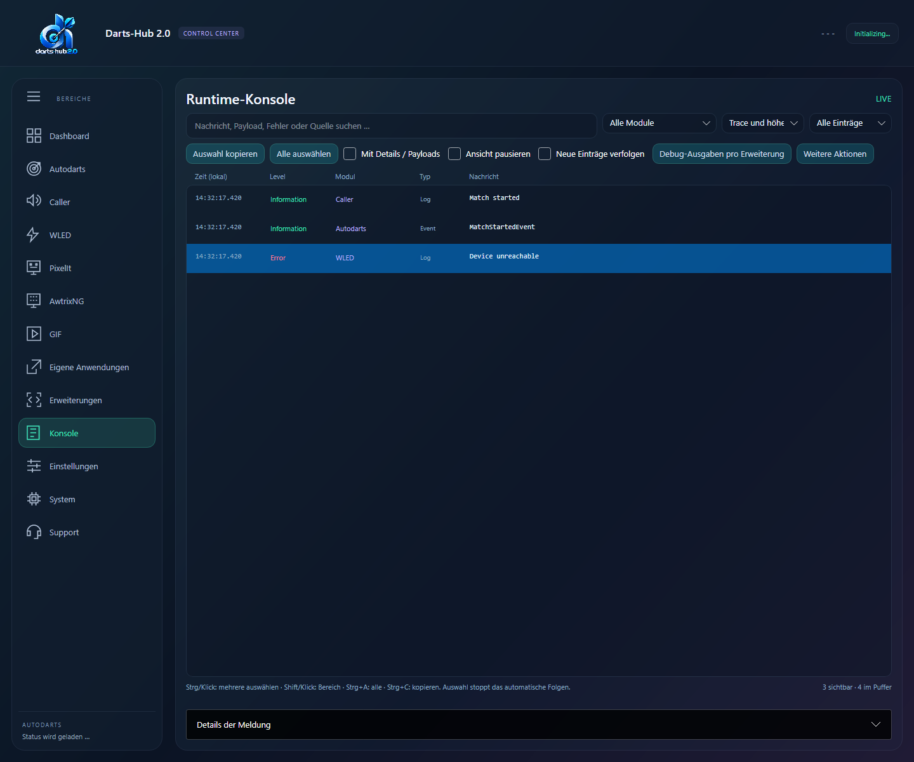

Vollständige Autodarts-Nachrichten in Konsole und Log benötigen die entsprechende Lizenzfunktion. Ohne sie wird weiterhin protokolliert, welches Ereignis eingetroffen ist.

| Problem | Das kannst du prüfen |
| --- | --- |
| Kein Match oder keine Reaktion | Ist Autodarts verbunden? Stimmt die Board-ID? Kommen Ereignisse an? |
| Keine Sprachansagen | Caller aktiviert, Soundpack heruntergeladen und ausgewählt, Lautstärke und Audioausgabe prüfen. |
| Kein Licht / keine Anzeige | Geräte erreichbar und aktiviert? Modul und Regel aktiviert? Richtige Zielgeräte? Regel manuell testen. |
| Effekt oder Preset fehlt | WLED-Controllerdaten manuell neu laden. |
| Änderung scheint wirkungslos | Wurde gespeichert? Passt das Ereignis oder der Spielerfilter? |
| Funktion gesperrt | Lizenzstatus und freigeschaltete Funktionen prüfen. |

### Supportanfrage senden

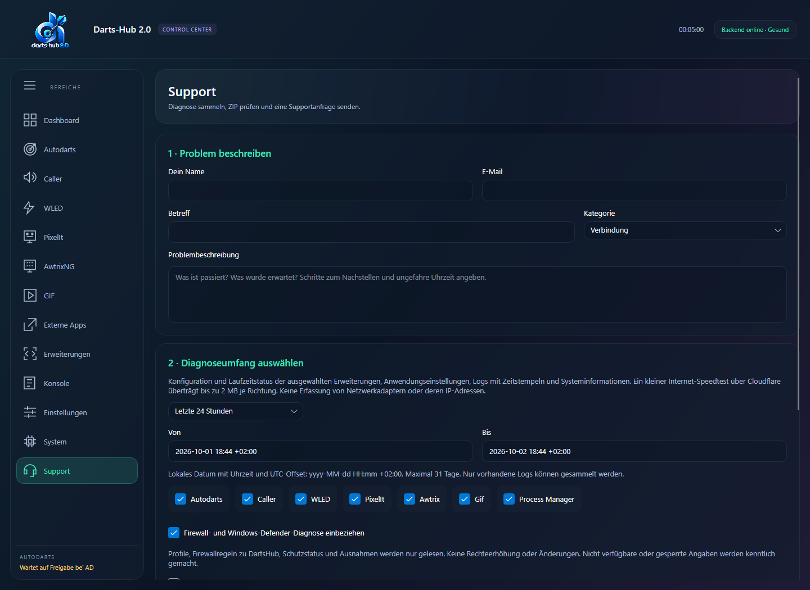

1. Öffne **Support** und fülle Kontaktangaben, Betreff, Kategorie und Problembeschreibung aus. Beschreibe auch, wie sich der Fehler wiederholen lässt.
2. Wähle Zeitraum und betroffene Erweiterungen. Zusätzliche System-/Sicherheitsangaben sind entsprechend auswählbar.
3. Lies die Hinweise, gib die Zustimmung und wähle **Diagnose sammeln**. Die Fortschrittsanzeige begleitet die Sammlung.
4. Prüfe die Dateiliste. Du kannst das ZIP vor dem Versand lokal speichern und ansehen.
5. Sende die Anfrage und bewahre die angezeigte Anfrage-ID auf. Nach Änderungen am Formular musst du die Sammlung erneut erstellen.

Die Sammlung enthält ausgewählte Einstellungen, Logs und Systeminformationen. Passwörter und Anmeldeschlüssel werden ausgeschlossen beziehungsweise maskiert. Netzwerkadapter und IP-/MAC-Adressen werden nicht gesammelt. Der kleine Internet-Geschwindigkeitstest speichert keine IP-Adresse. Ist der Upload nicht verfügbar, kannst du das Diagnose-ZIP trotzdem lokal speichern.

## 10. TUI und Headless

**TUI** ist die bedienbare Oberfläche im Terminal. **Headless** lässt Darts-Hub ohne Oberfläche laufen. Beides ist in derselben Anwendung enthalten.

| Modus | Windows | Linux |
| --- | --- | --- |
| Terminal-Oberfläche | `.\DartsHub.exe --tui` | `./DartsHub --tui` |
| Ohne Oberfläche | `.\DartsHub.exe --headless` | `./DartsHub --headless` |

Unter macOS verwende statt `./DartsHub` den Pfad `./DartsHub.app/Contents/MacOS/DartsHub`.

Beim TUI-Start wird ein vorhandener lokaler Host verwendet oder bei Bedarf automatisch einer gestartet. Ein automatisch gestarteter Host endet mit der TUI, solange Headless-Autostart ausgeschaltet ist. Bei aktiviertem Autostart läuft Headless nach dem Schließen im Hintergrund weiter. Ein separat gestarteter Host läuft ebenfalls weiter. Unter Windows öffnet sich für die TUI ein eigenes Terminalfenster.

Mit **Tab** wechselst du zwischen Bereichen, mit **Pfeiltasten** wählst du Einträge, **Enter** bestätigt und **Esc** schließt Dialoge. Die Navigation bietet Autodarts, Caller, WLED, PixelIt, AwtrixNG, GIF, Konsole, Einstellungen/Lizenz und Support. Die Einrichtung folgt denselben Schritten wie oben: bearbeiten, testen, speichern. Auch Import und Diagnose-ZIPs sind dort verfügbar.

Für einen dauerhaften Betrieb starte Headless separat und öffne die TUI zusätzlich. Startargumente können Einstellungen direkt setzen:

```powershell
.\DartsHub.exe --headless --caller-enabled false --wled-enabled true
```

Die Werte werden gespeichert. Die beiliegenden `start.bat` beziehungsweise `start.sh` sind anpassbare Beispiele; prüfe ihre Vorgaben vor dem Start. `start-pixelit.bat` beziehungsweise `start-pixelit.sh` zeigen eine PixelIt-Einrichtung. Alle Startoptionen findest du mit `--help` oder in der [Argumentübersicht](docs/START_ARGUMENTS.md).

Auch **PixelIt** zeigt Vorlagen und Anzeigeschritte in einer virtuellen LED-Matrix. Text und Helligkeit aktualisieren sich direkt; die Bitmap-Grafiken werden aus der Vorlage gelesen. Die TUI bietet die Vorschau im Anzeigeschritt. Bei animierten Vorlagen ist das erste Bild zu sehen.

## 11. AwtrixNG und GIF

Beide Erweiterungen arbeiten direkt mit Autodarts und brauchen keinen laufenden Caller. Verbinde zuerst dein Board. Die Schalter im Dashboard aktivieren oder deaktivieren die Erweiterung sofort. Änderungen innerhalb der Einstellungen übernimmst du mit **Speichern**; ein **Test** verwendet deine aktuellen Eingaben, ohne sie zu speichern.

### Live-Anzeige nach jedem Wurf (PixelIt und AwtrixNG)

**Eine Matrix für alle Spieler:** Lege zwei Regeln an: **Nach jedem Wurf** und **Spielerwechsel**. Lass den Spielerfilter leer und wähle in beiden Regeln dieselbe Matrix als Ziel. Aktiviere **Vorlagentext ersetzen** und trage z. B. ein:

```text
{playername} {points-left} D{dart-number}
```

Die Anzeige startet mit dem aktiven Spieler, aktualisiert sich nach jedem Wurf und wechselt beim Spielerwechsel automatisch. Bei PixelIt setze die Pause danach für eine schnelle Anzeige auf 0.

**Eine Matrix je Spieler:** Verwende dieselben Ereignisse und pro Matrix einen Text mit fester Spielernummer, etwa:

```text
{p1-playername} {p1-points-left} D{p1-darts-thrown}
```

Auf der zweiten Matrix ersetze `p1` durch `p2`, usw. Die Nummern bleiben gleich, auch wenn sich der Startspieler ändert. Lass den Spielerfilter leer, damit die Werte bei jedem Ereignis aktualisiert werden. Weise den Anzeigeschritt jeweils der gewünschten Matrix zu.

| Platzhalter | Bedeutung |
| --- | --- |
| `{dart-score}` | Punkte des letzten Darts |
| `{dart-number}` | Dartnummer in der aktuellen Aufnahme (0–3) |
| `{darts-thrown}` | Anzahl geworfener Darts im aktuellen Leg |
| `{turn-score}` | Punkte der aktuellen Aufnahme |
| `{points-left}` | Restpunkte des ausgewählten/aktiven Spielers |
| `{p1-points-left}`, `{p1-darts-thrown}` | Feste Werte von Spieler 1; ebenso für p2 bis p32 |

Korrekturen, Zurücknehmen und Überwerfen verwenden die von Autodarts gemeldeten Werte. In der TUI stehen dieselben Ereignisse und Textfelder zur Verfügung. Headless-Konfigurationen verwenden die Auslöser `Throw` und `PlayerChanged`.

### AwtrixNG: Display verbinden

1. Öffne **AwtrixNG → Geräte**, aktiviere die Erweiterung und füge ein Display hinzu.
2. Gib einen Namen und die Adresse deines Displays ein, beispielsweise `awtrix.local`. Falls dein Display eine HTTP-Anmeldung verlangt, ergänze Benutzer und Passwort.
3. Prüfe das Gerät. Der Status zeigt, ob es erreichbar ist. Weitere Displays kannst du auf dieselbe Weise hinzufügen.
4. Speichere die Einstellungen. Diese Erweiterung benötigt **AwtrixNG-Firmware**; die frühere AWTRIX3-Firmware verwendet eine andere Schnittstelle.

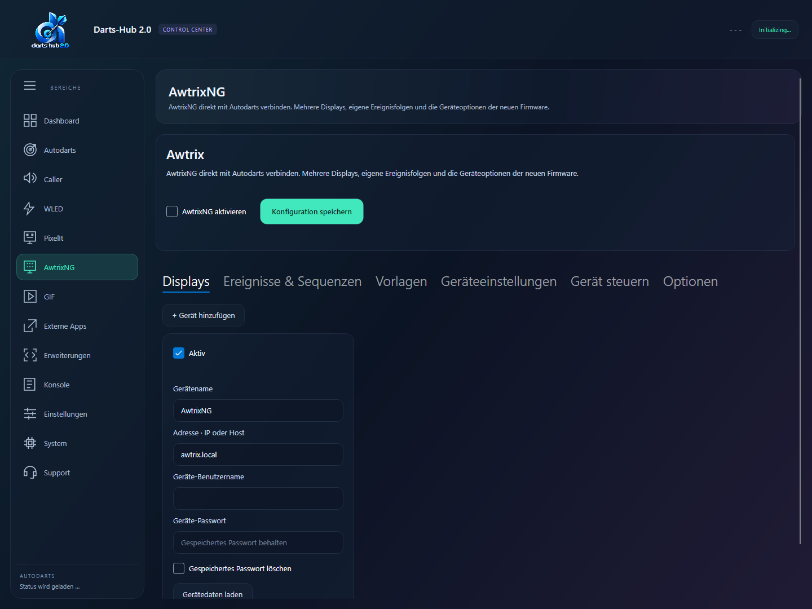

### AwtrixNG: Auf ein Ereignis reagieren

1. Öffne **Ereignisse**, füge eine Regel hinzu und benenne sie, beispielsweise „180“.
2. Wähle das Ereignis und gegebenenfalls die Punktzahl. Ein leerer Spielerfilter gilt für alle passenden Spieler.
3. Ergänze einen Schritt und wähle Vorlage, Text und Zielgeräte. Mit `{score}` und `{playername}` setzt du die Punktzahl und den Spielernamen in den Text ein.
4. Wähle bei Bedarf Icon, Farbe und Dauer. Mehrere Schritte werden nacheinander angezeigt; die Zielgeräte können pro Schritt unterschiedlich sein.
5. Teste die Regel und speichere sie. Ab dann reagiert sie auf passende Autodarts-Ereignisse.

Unter **Wann anzeigen?** wählst du das auslösende Ereignis. **Anzeigevorlage** bestimmt nur das Aussehen. Neue Anzeigeschritte erhalten automatisch eine passende Vorlage. Bei bestehenden Schritten kannst du den Vorschlag mit **Vorlage übernehmen** anwenden; eigene Texte bleiben erhalten. In der TUI findest du dieselben Optionen im Ereignis und im Anzeigeschritt.

Die **virtuelle LED-Matrix** zeigt die Vorlage direkt beim Bearbeiten, inklusive eigenem Text und Farben. Lange Texte scrollen. In der TUI öffnest du die Vorschau im Anzeigeschritt. Die Vorschau verwendet Beispielwerte; Geräte-Icons und Firmware-Effekte können abweichen.

Textfarben lassen sich per Colorpicker oder Hexwert auswählen. Helligkeit und Scrollgeschwindigkeit werden sofort in der lokalen Vorschau übernommen. In der TUI stehen Farbvorgaben und eigene Hexwerte zur Verfügung.

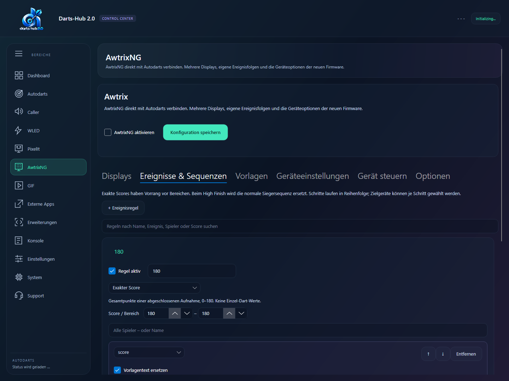

Unter **Display-Einstellungen** stellst du beispielsweise Helligkeit, Texte und Bildschirmwechsel ein. Aktiviere nur die Werte, die Darts-Hub auf dem Display vorgeben soll. Die übrigen Werte bleiben auf dem Gerät bestehen. Hilfetexte erklären jede Einstellung.

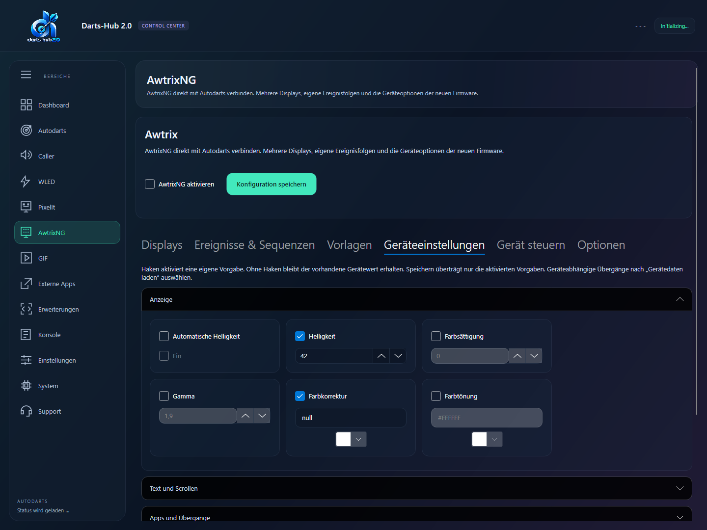

Unter **Gerätesteuerung** kannst du das Display ein- oder ausschalten, den Bildschirm wechseln und Audio stoppen. Die erweiterten Aktionen sind für gezielte Geräteverwaltung gedacht; für den normalen Spielbetrieb reicht die Ereignisregel.

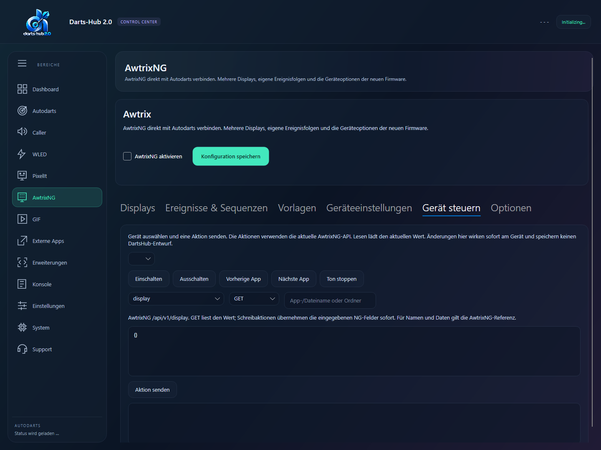

### GIF: Bilder vorbereiten

1. Lege deine GIF-, PNG- oder JPEG-Dateien in einen Ordner, beispielsweise `C:\DartsHub\Media`.
2. Öffne **GIF → Medien**, trage diesen Ordner ein und speichere. Die Dateiliste zeigt die gefundenen Bilder.
3. Lokale Dateien benötigen keine Online-Suche. Wenn du Bilder über eine direkte öffentliche HTTPS-Adresse oder eine Suche verwenden möchtest, wählst du diese Quelle später in der Regel.

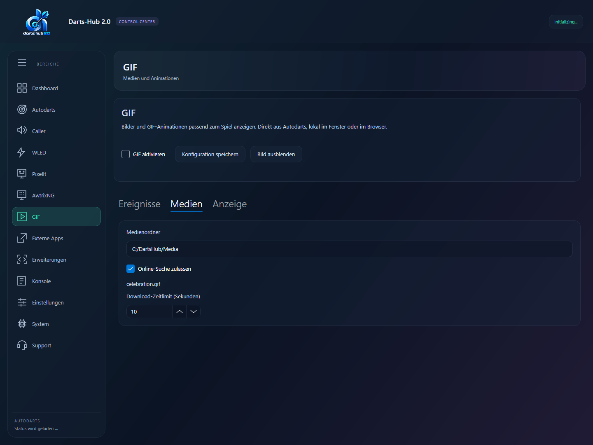

### GIF: Eine Anzeige testen

1. Öffne **Ereignisse**, aktiviere GIF und füge eine Regel hinzu, beispielsweise für 180 Punkte, Bust oder einen Spielgewinn.
2. Wähle die Quelle **Lokale Datei** und trage einen Dateinamen wie `celebration.gif` ein. Ergänze bei Bedarf einen Spielerfilter.
3. Wähle eine Dauer in Sekunden. **Dauer 0** lässt das Bild bis zum Entfernen der Darts stehen.
4. Teste die Regel und speichere. Mehrere Bilder innerhalb derselben Regel sind zufällige Alternativen, keine Abfolge. Mit **Bild ausblenden** beendest du die aktuelle Anzeige sofort.

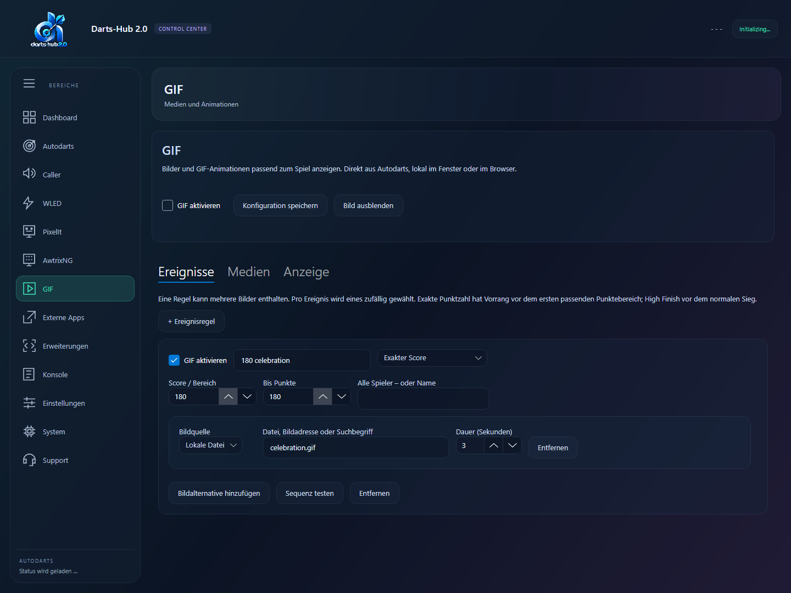

Unter **Anzeige** wählst du Anwendungsfenster, Browser oder beides. Für das Anwendungsfenster kannst du Monitor, Vollbild und Vordergrund einstellen. **Headless benötigt die Browseranzeige**: Speichere den Browsermodus und öffne die angezeigte Adresse. Doppelklick im Browser schaltet auf Vollbild. Wenn du Zugriff aus dem Netzwerk aktivierst, behandle die Anzeigeadresse samt Zugangsschlüssel vertraulich.

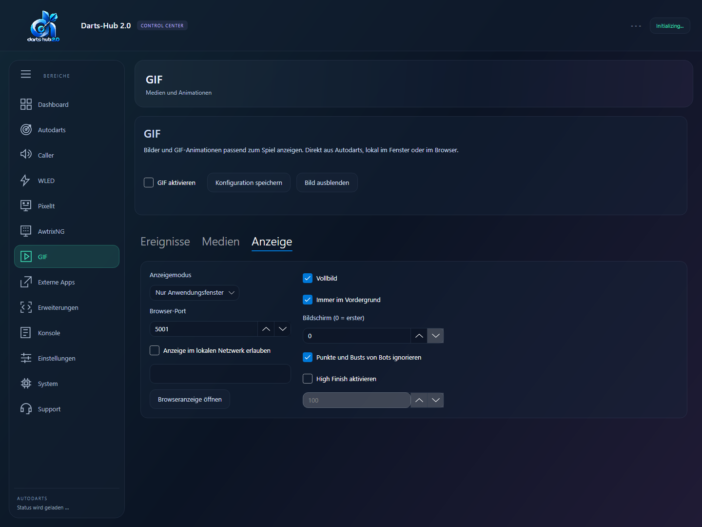

Keine Reaktion? Prüfe Autodarts-Verbindung, Erweiterungsschalter, aktivierte Regel, Spielerfilter und Zielgerät beziehungsweise Dateinamen. Die Konsole zeigt passende Ereignisse und Fehler; Debugmeldungen lassen sich je Erweiterung einblenden.

Die TUI bietet dieselben Einstellungen und Tests auf den Seiten **AwtrixNG** und **GIF**. Mit **Enter** öffnest du eine Einstellung, danach testest und speicherst du wie in der GUI. Kurzanleitungen: [AwtrixNG](docs/AWTRIX.md) · [GIF](docs/GIF.md).

## 12. Automatisch starten und im Hintergrund laufen

In **Einstellungen → Autostart** kannst du die GUI beim Anmelden automatisch starten lassen, wahlweise minimiert. In der TUI kannst du Headless-Autostart beziehungsweise den Benutzerdienst aktivieren. Dann bleibt der Host auch nach dem Schließen der TUI aktiv. **Headless beenden** stoppt ihn; um zukünftige Starts zu verhindern, deaktiviere auch den Autostart.

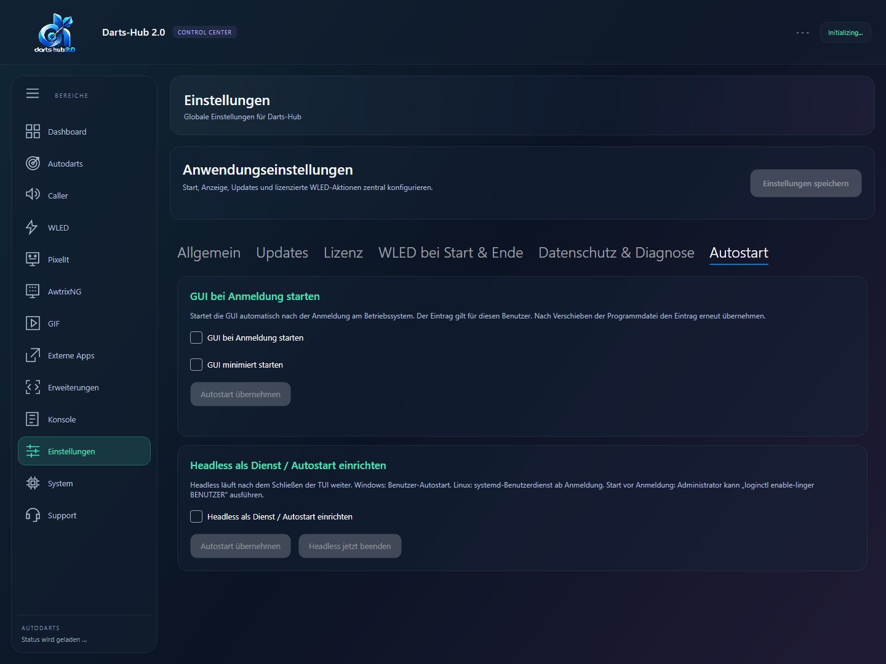

Unter Linux wird ein systemd-Benutzerdienst eingerichtet. Für Betrieb schon vor der Anmeldung ist gegebenenfalls einmalig ein Administrator-Schritt nötig. Siehe [Autostart-Anleitung](docs/AUTOSTART.md).

Weitere Einzelheiten bei Bedarf: [WLED](docs/WLED_CONFIGURATION_AND_AUTODARTS.md), [PixelIt](docs/PIXELIT.md), [Terminal-Bedienung](docs/TUI.md).

## 13. Eigene Programme und Skripte mitstarten

Unter **Eigene Anwendungen** kannst du ein Programm oder Skript hinzufügen, Datei und Startargumente wählen und **Mit DartsHub starten** aktivieren. Klicke anschließend auf **Speichern und anwenden**.

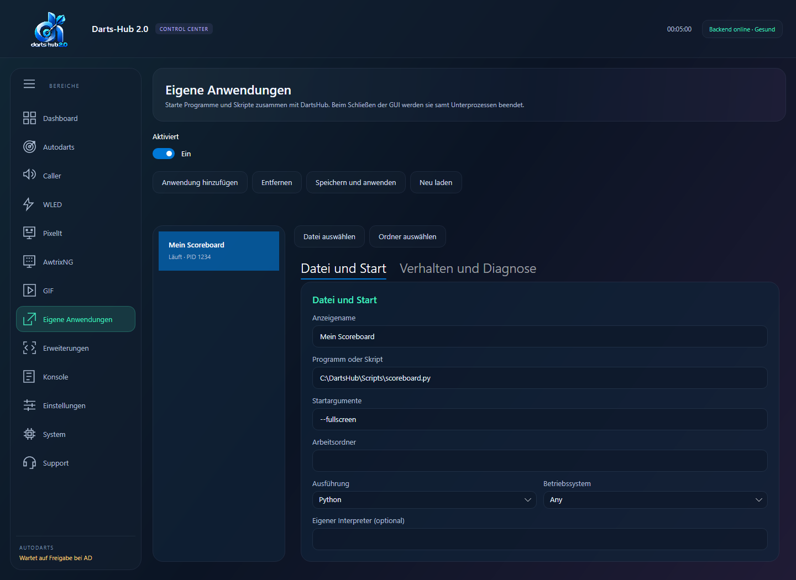

Jeder gespeicherte Eintrag erscheint im Dashboard mit seinem echten Status und den Aktionen **Starten**, **Beenden** und **Neu starten**. Beim Schließen der GUI werden die von DartsHub gestarteten Anwendungen einschließlich ihrer Unterprozesse beendet. Die Einstellungen bleiben für den nächsten Start gespeichert.

Die TUI bietet dieselbe Funktion auf der Seite **Eigene Anwendungen**. Headless verwendet die gespeicherten Einstellungen. Beispiele und Startoptionen: [Eigene Anwendungen](docs/OWN_APPLICATIONS.md).

Die Startverzögerung unter **Einstellungen** hält die Modulinitialisierung, eigene Autostart-Anwendungen und die Updateprüfung zurück. **Jetzt starten** gibt den Start vorzeitig frei. Die TUI bietet denselben Countdown; Headless wartet ebenfalls. Eine bereits laufende Laufzeit wird beim Anbinden einer weiteren Oberfläche nicht erneut verzögert.

Wenn eine neue Version verfügbar ist, erscheint nach dem Start-Countdown ein Update-Dialog mit den Release Notes. Mit **Später** verschiebst du das Update; unter Einstellungen → Updates → **Update ansehen** kannst du den Dialog wieder öffnen. In der TUI lassen sich die Release Notes ebenfalls in den Update-Einstellungen lesen.
## Raspberry Pi

Hinweise zu 64-Bit Raspberry Pi OS, der Architekturerkennung und der Caller-Audioausgabe findest du in der [Raspberry-Pi-Anleitung](docs/RASPBERRY_PI.md).

### Ereignisvorlagen

Vorlagen besitzen eine frei editierbare Beschreibung des Auslösers und der Ausgabe. Die Bibliothek findest du im Reiter **Ereignisse und Sequenzen** der jeweiligen Erweiterung.

In WLED, PixelIt und Awtrix öffnet **Ereignisvorlagen** die Bibliothek: eine bestehende Regel auswählen, benennen und speichern oder eine Vorlage als neue Regel laden. Gleiche Vorlagennamen werden ersetzt. Bedingungen, Effekte, Farben, Schritte und Zielauswahl werden gespeichert. Anschließend Ziele prüfen und die Erweiterung speichern. Fehlende Zielgeräte deaktivieren die geladene Regel.

Die TUI bietet dieselben Aktionen unter **Ereignisvorlagen**. WLED-Regeln werden anschließend über „WLED konfigurieren“ gespeichert. Die Dateien `event-templates/wled.json`, `pixelit.json` und `awtrix.json` liegen neben der Anwendung, mit Beispielen. Sie lassen sich sichern oder auf einen anderen Rechner kopieren. Schreibrechte im Anwendungsordner sind erforderlich.

Die Konsole hält Suche und Filter beim Scrollen sichtbar. Mit **Strg/Klick** wählst du mehrere Meldungen, mit **Shift/Klick** einen Bereich und mit **Strg+A** alle gefilterten Meldungen. **Strg+C** oder **Auswahl kopieren** kopiert die Auswahl mit Zeitstempeln; **Mit Details / Payloads** ergänzt die verfügbaren Details. Die Auswahl stoppt das automatische Folgen; über **Neue Einträge verfolgen** aktivierst du es wieder. Debug-Schalter und weitere Aktionen sind aufklappbar. In der TUI kannst du alle gefilterten Meldungen oder einen Zeilenbereich gemeinsam in der Textansicht zum Kopieren öffnen.

Für die Headless-Anmeldung genügen `--board-id "DEINE-BOARD-ID" --ad-login`. Weitere interne Authentifizierungsparameter sind nicht erforderlich.

Beim ersten Start verwendet DartsHub die Betriebssystemsprache (Deutsch oder Englisch; sonst Englisch). Eine selbst gewählte Sprache bleibt nach Neustarts erhalten. In der Konsole bietet das Rechtsklick-Menü **Nur Meldungen kopieren** und **Meldungen mit Details / Payloads kopieren** für die gesamte Auswahl.

Normale Punkte-, Punktebereich- und Kombinations-Effekte laufen erst nach dem dritten Dart. Bust, Sieg und Start-/Board-Ereignisse sind Ausnahmen. WLED-Einzelwurfregeln (DartScore/DS, DartField und Multiplier/DMU) sowie ausdrückliche Throw-Anzeigen bleiben sofort aktiv. Das gilt auch für die TUI und Headless-Konfiguration.

Logs liegen unter `logs`: `DartsHub_04.log` für alle Meldungen und beispielsweise `Caller/Caller_04.log` für den Caller. Neustarts am selben Tag hängen Meldungen an. Am gleichen Kalendertag im nächsten Monat wird die Datei neu begonnen; die Dateigröße ist nicht begrenzt.
