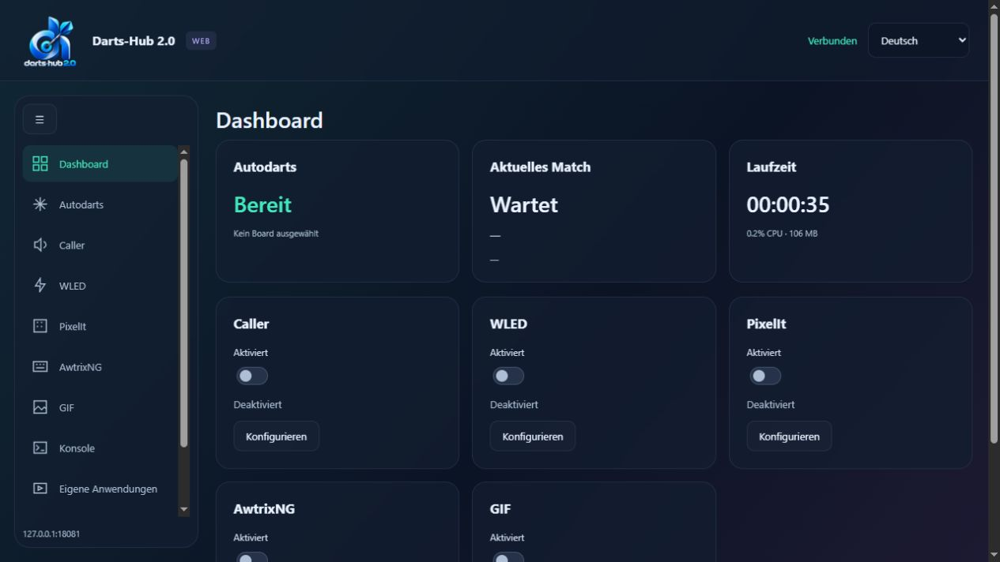
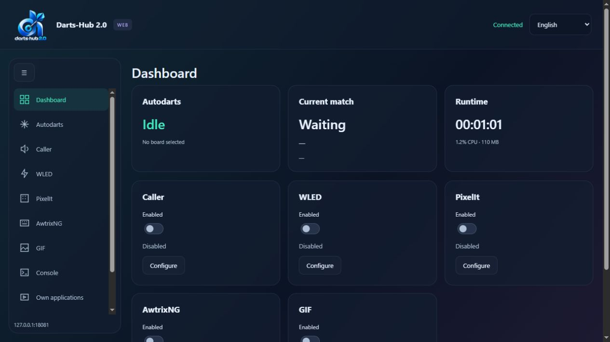

# Darts-Hub im Browser / Darts-Hub in your browser

## Deutsch

Die Bilder zeigen einen lokalen Testbetrieb mit abweichendem Port. Im normalen Betrieb verwendest du Port 8079.

Darts-Hub stellt automatisch eine Weboberfläche bereit, sobald die Anwendung läuft. Das gilt für die GUI und für `--headless`; du brauchst keinen zusätzlichen Webserver.

1. Starte Darts-Hub auf dem Rechner, der deine Erweiterungen steuern soll.
2. Öffne auf einem Gerät im selben Netzwerk `http://IP-DES-RECHNERS:8079`, beispielsweise `http://192.168.1.100:8079`.
3. Wähle im Seitenmenü die gewünschte Erweiterung. Bearbeite ihre Einstellungen und drücke **Speichern**. Dashboard-Schalter wirken sofort.

Die Weboberfläche bietet Autodarts-Anmeldung und Board-Auswahl, Caller und Soundpacks, WLED, PixelIt, AwtrixNG, GIF, eigene Anwendungen, Konsole, Lizenz, allgemeine Einstellungen, Import, Telemetrie und Support. Die gemeinsamen Einstellungen werden auf dem Darts-Hub-Rechner gespeichert und gelten auch für GUI und TUI. Speichere deine Änderungen, bevor du in einer anderen Oberfläche weiterarbeitest; mit **Neu laden** holst du den gespeicherten Stand.

Farben, Karten, Logo und das einklappbare Seitenmenü folgen der GUI. Auf schmalen Bildschirmen bleibt das Menü als Symbolleiste sichtbar. PixelIt und AwtrixNG haben eine Live-Matrixvorschau mit Beispielwerten; **Am Gerät testen** sendet die aktuelle Regel an die eingerichteten Geräte. WLED nutzt den vorhandenen Controller-Katalog. **Gerät laden / testen** aktualisiert diesen bewusst.

In der Konsole kannst du mit Strg-Klick mehrere Meldungen oder mit Umschalt-Klick einen Bereich auswählen. Rechtsklick bietet **Meldungen kopieren** oder **Mit Details kopieren**. Debug ist zunächst ausgeblendet. Die bestehende Lizenzregel für vollständige WebSocket-Payloads gilt weiterhin.

Die erste Sprache folgt der Betriebssystemsprache des Darts-Hub-Rechners: Deutsch, sonst Englisch. Eine später gewählte Sprache wird gespeichert. Fenster, Monitorwahl und GUI-Autostart sind bewusst der Desktop-GUI vorbehalten. Ein Headless-Host kann im Browser für den Autostart eingerichtet und beendet werden.

Dateipfade und gestartete Skripte beziehen sich auf den Darts-Hub-Rechner. Caller-Sounddateien und Vorschauen werden zusätzlich auf deinem Browsergerät abgespielt, wenn du oben im Dashboard **Audio hier aktivieren** wählst. Support-ZIP-Dateien können im Browser heruntergeladen werden; ein Upload erfolgt erst über **Senden** nach Bestätigung. Die Update-Suche wartet auf das Ende der Startverzögerung und zeigt formatierte Release Notes.

Die Seite öffnet sich direkt ohne Zugangscode. Beim Schließen der GUI endet auch deren Webserver. Ein als Service eingerichteter Headless-Host bleibt nach dem Schließen der TUI aktiv.

Falls ein anderer Rechner die Seite nicht erreicht, prüfe die IP-Adresse und erlaube eingehende TCP-Verbindungen auf Port **8079** in der Firewall für dein lokales Netzwerk. Die Webseite verwendet im lokalen Netzwerk HTTP; richte dafür keine Internet-Portweiterleitung ein. Bei mehreren Hosts auf demselben Rechner kann der Port mit `--DartsHub:WebPort 8080` geändert werden; `0` deaktiviert den zusätzlichen Netzwerk-Port. Die lokale API auf Port 5069 bleibt bestehen.

## English

Screenshots show a local test host using a different port. Normal installations use port 8079.

Darts-Hub automatically serves its web interface while the application is running, both with the desktop GUI and with `--headless`. No separate web server is needed.

1. Start Darts-Hub on the computer that controls your extensions.
2. From a device on the same network, open `http://HOST-IP:8079`, for example `http://192.168.1.100:8079`.
3. Select an extension in the sidebar, adjust its settings and click **Save**. Dashboard switches apply immediately.

The web interface includes Autodarts login and board selection, Caller and soundpacks, WLED, PixelIt, AwtrixNG, GIF, external applications, console, licensing, application settings, legacy import, telemetry and support. Shared settings are saved on the host and also apply to the GUI and TUI. Save before switching frontends; **Reload** retrieves the latest saved configuration.

Colors, cards, logo and collapsible navigation follow the desktop GUI. Narrow screens use icon navigation. PixelIt and AwtrixNG provide live matrix previews with example values. **Test on device** sends the current rule to the configured devices. WLED uses its loaded controller catalog; **Load / test device** explicitly refreshes it.

Use Ctrl-click to select console messages or Shift-click to select a range. Right-click offers **Copy messages** and **Copy with details**. Debug output is initially hidden. Existing license restrictions on full WebSocket payloads continue to apply.

The initial language follows the host operating system: German or otherwise English. A manually selected language is saved. Window positioning, monitor selection and GUI autostart stay in the desktop application. A headless host can be configured for autostart and stopped through the web interface.

File paths and scripts refer to the host computer. Caller sound files and previews also play on your browser device after you choose **Enable audio here** at the top of the dashboard. Download support ZIPs in your browser; upload only starts after choosing **Send** and confirming. Update checks wait until the startup countdown finishes and show formatted release notes.

The page opens directly without an access code. Closing the GUI also stops its web server. A headless service continues running after you close the TUI.

If another device cannot reach the page, check the host IP and permit incoming TCP traffic on **8079** in your firewall for your local network. The local interface uses HTTP; do not forward this port to the internet. Multiple hosts on one computer can use `--DartsHub:WebPort 8080`; `0` disables the additional network listener. The existing local API remains on port 5069.

## Caller-Audio im Browser / Caller browser audio

**Deutsch:** Oben im Dashboard befindet sich die Audio-Karte, auch in der mobilen Ansicht. Aktiviere die Wiedergabe mit einem Klick; der Browser benötigt diese Freigabe nach jedem Neuladen pro Tab. Die Lautstärke gilt nur für diesen Tab. Die Wiedergabe läuft beim Wechsel zwischen Seiten der Weboberfläche weiter. Deaktivieren oder Schließen des Tabs beendet sie. Nach einem Verbindungsverlust wird neu verbunden; bereits unterbrochene Ansagen werden nicht nachgeholt.

Für Spielansagen muss der Caller eingeschaltet und Autodarts verbunden sein. Die lokale Caller-Ausgabe kann eingeschaltet bleiben oder ausgeschaltet werden; eine Soundkarte am Host ist für Browser-Audio nicht erforderlich. Sounddateien werden als vollständige Ansage ohne zusätzliche Pausen zwischen den einzelnen Dateien übertragen. Die bestehenden Regeln für Unterbrechungen und Gesamtscores gelten weiter. Betriebssystem-Sprachausgabe (TTS) bleibt auf dem Host; Browser-Audio überträgt Soundpack-Dateien. Ein Smartphone kann Audio im Hintergrund oder bei gesperrtem Bildschirm pausieren; lasse die Seite für zuverlässige Wiedergabe sichtbar.

**GUI/TUI:** Öffne die Webadresse unter den allgemeinen Einstellungen in der GUI beziehungsweise auf der Seite **Weboberfläche** in der TUI. Aktiviere anschließend Browser-Audio im Dashboard des gewünschten Browsers. Diese Freigabe ist keine gespeicherte Moduleinstellung; bestehende Konfigurationen und JSON-Importe bleiben gültig.

**English:** The audio card appears at the top of the dashboard, including on mobile. Click to enable playback; each tab needs this browser permission again after a reload. Volume applies only to this tab. Audio continues while navigating the web interface. Disabling playback or closing the tab stops it. A lost connection reconnects automatically without replaying interrupted announcements.

For game announcements, enable Caller and connect Autodarts. Local Caller output can remain enabled or be disabled; the host does not need a sound card for browser audio. Sound files are transferred as complete phrases without extra gaps between individual files. Existing interruption and total-score rules still apply. Operating-system text-to-speech (TTS) remains on the host; browser audio carries soundpack files. Phones may pause background audio or audio while locked; keep the page visible for reliable playback.

**GUI/TUI:** Open the web address from GUI application settings or the TUI **Web interface** page, then enable browser audio in that browser's dashboard. This permission is not a saved module setting; existing configurations and JSON imports remain valid.

## Webapp installieren / Install the web app

**Deutsch:** Beim Öffnen bietet Darts-Hub die Installation an. In Android-Browsern mit Installationsunterstützung öffnet **Installieren** den Browserdialog. Der Browser entscheidet, wann er diesen freigibt; eine vertrauenswürdige HTTPS-Adresse ist dafür erforderlich. Bei der üblichen lokalen HTTP-Adresse zeigt Darts-Hub stattdessen die Browsermenü-Anleitung. Eine dort angelegte Verknüpfung ist nicht zwingend eine vollständig installierte App.

Auf iPhone und iPad: Seite in Safari öffnen → **Teilen → Zum Home-Bildschirm → Hinzufügen**. Falls vorhanden, **Als Web-App öffnen** eingeschaltet lassen. Die Webseite kann dieses Systemmenü nicht selbst öffnen. Das App-Symbol verwendet das Darts-Hub-Logo.

**Später erinnern** blendet die Nachfrage sieben Tage aus; **Nicht mehr fragen** dauerhaft für diesen Browser und diese Adresse. Über **Webapp installieren** im Kopfbereich lässt sich die Anleitung jederzeit wieder öffnen. Bereits als Webapp gestartete Fenster zeigen keine Nachfrage. Die Installation übernimmt keine neue Caller-Logik und garantiert keine Hintergrundwiedergabe. Die App benötigt weiterhin die Verbindung zum Darts-Hub-Rechner; Einstellungen und Audio werden nicht offline zwischengespeichert.

**GUI/TUI:** Die bestehende Webadresse in den allgemeinen GUI-Einstellungen beziehungsweise auf der TUI-Seite **Weboberfläche** öffnen; anschließend im Browser installieren. Es gibt keine neue gespeicherte Moduleinstellung oder Änderung am JSON-Import.

**English:** Darts-Hub offers installation when opened. On supported Android browsers, **Install** opens the browser's installation dialog when available. The browser controls availability and requires a trusted HTTPS address. At the usual local HTTP address, Darts-Hub shows browser-menu instructions instead; a shortcut created there may not be a fully installed app.

On iPhone and iPad: open in Safari → **Share → Add to Home Screen → Add**. Leave **Open as Web App** enabled if shown. The website cannot open this system menu itself. The app icon uses the Darts-Hub logo.

**Remind me later** hides the prompt for seven days; **Do not ask again** hides it permanently for this browser and address. The header's **Install web app** button reopens the instructions. Standalone app windows do not show the prompt. Installation does not change Caller logic or guarantee background audio. A connection to the Darts-Hub host remains necessary; settings and audio are not cached for offline use.

**GUI/TUI:** Open the existing web address from GUI application settings or the TUI **Web interface** page, then install in the browser. No saved module setting or JSON-import change is introduced.

Online-Webapp mit individueller Kopplung und direkte lokale HTTPS-Einrichtung / Online web app pairing and direct local HTTPS setup: [HTTPS](WEB_HTTPS.md).
